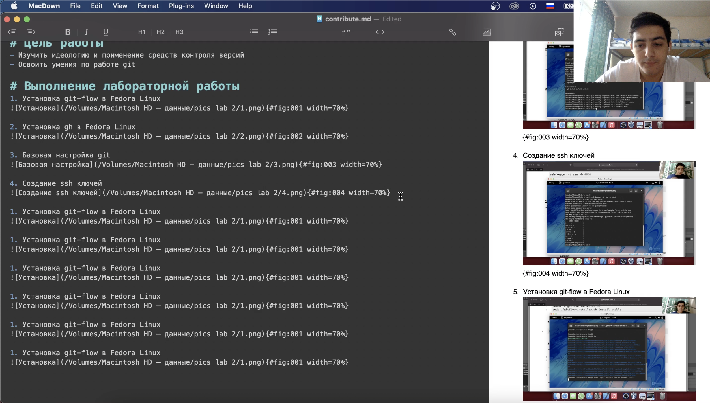
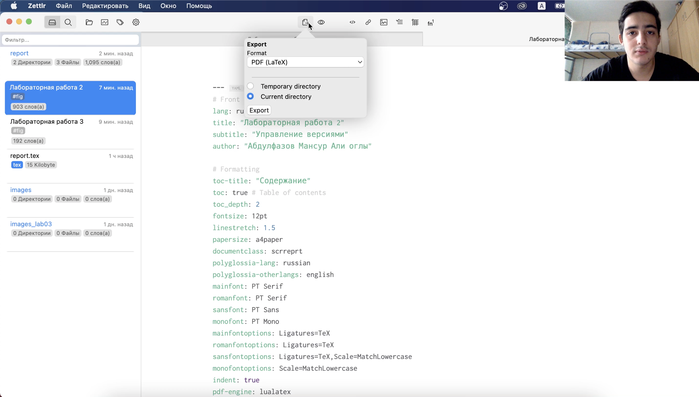
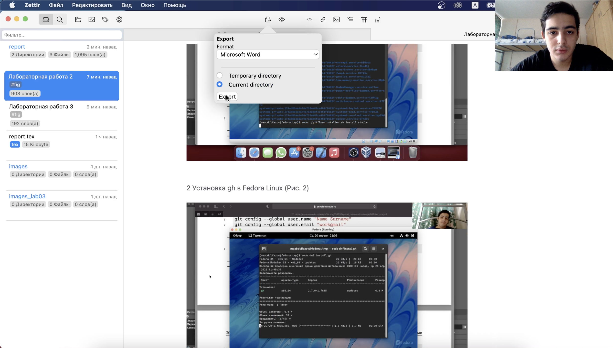
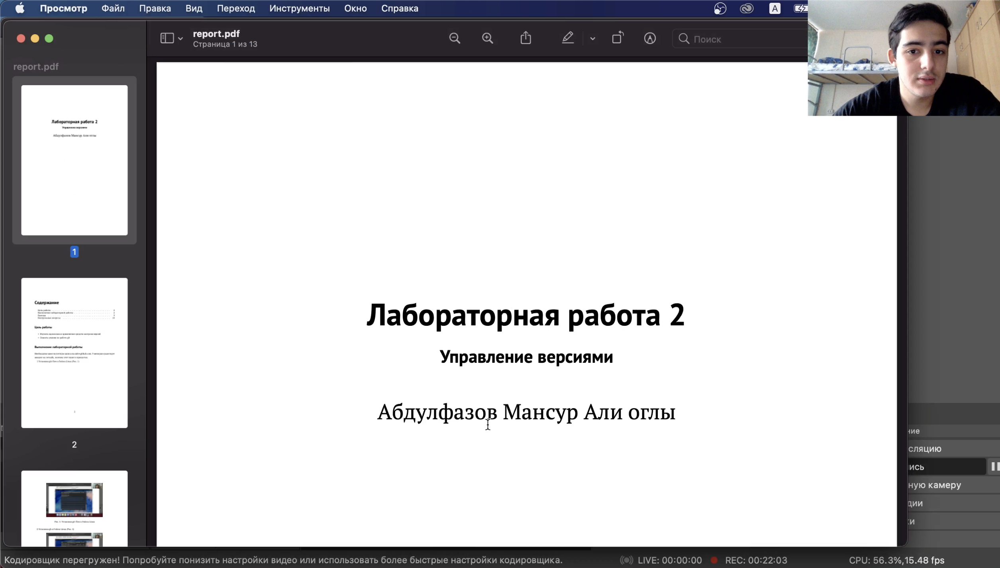
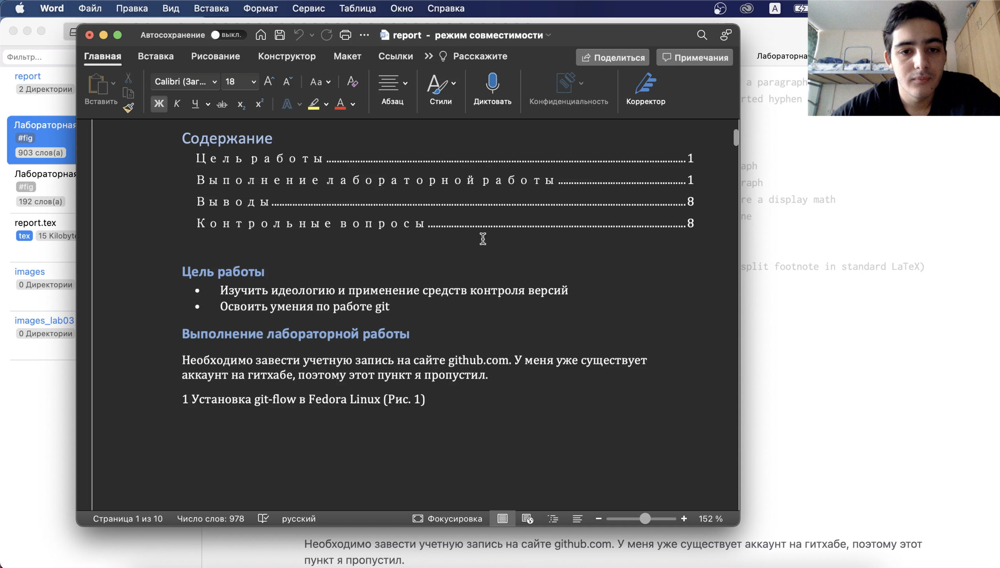

---
## Front matter
lang: ru-RU
title: Markdown
author: Мансур А. о. Абдулфазов\inst{1,3}
	
date: 28 Апреля, 2021, Россия, Москва

## Formatting
toc: false
slide_level: 2
theme: metropolis
header-includes: 
 - \metroset{progressbar=frametitle,sectionpage=progressbar,numbering=fraction}
 - '\makeatletter'
 - '\beamer@ignorenonframefalse'
 - '\makeatother'
aspectratio: 43
section-titles: true
---

## Цель работы

- Научиться оформлять отчёты с помощью легковесного языка разметки Markdown.

## Задание 

- Сделайте отчёт по предыдущей лабораторной работе в формате Markdown.
- В качестве отчёта просьба предоставить отчёты в 3 форматах: pdf, docx и md (в архиве)

## Теоретическое введение

Markdown — облегчённый язык разметки, созданный с целью обозначения форматирования в простом тексте, с максимальным сохранением его читаемости человеком, и пригодный для машинного преобразования в языки для продвинутых публикаций (HTML, Rich Text и других).

## Выполнение лабораторной работы

1. Создание отчёта в формате md по шаблону (Рис.1)

## 

2. Конвертирование файла md в формат pdf. 

##

3. Конвертирование файла md в формат docx 

##

4. Результат конвертирования в pdf и docx. (рис. 4 и рис. 5)

 

## Вывод

Научился оформлять отчёты с помощью языка Markdown. Также разобрался в некоторых редакторах markdown. Научился конвертировать файлы с помощью pandoc.