---
## Front matter
lang: ru-RU
title: Основы интерфейса взаимодействия пользователя с системой Unix на уровне командной строки
author: Мансур А. о. Абдулфазов\inst{1,3}
        Группа НФИбд-01-21
date: 29 Апреля, 2021, Россия, Москва

## Formatting
toc: false
slide_level: 2
theme: metropolis
header-includes: 
 - \metroset{progressbar=frametitle,sectionpage=progressbar,numbering=fraction}
 - '\makeatletter'
 - '\beamer@ignorenonframefalse'
 - '\makeatother'
aspectratio: 43
section-titles: true
---

## Цель работы

Приобретение практических навыков взаимодействия пользователя с системой по\- средством командной строки.

## Выполнение лабораторной работы

1. Определил полное имя своего домашнего каталога. (рис. 1)

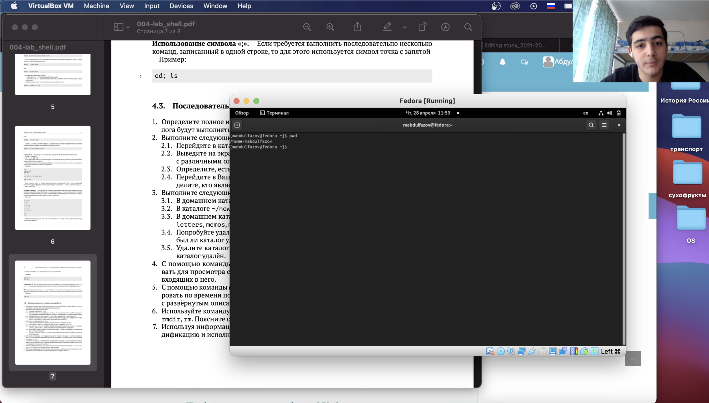{ #fig:001 width=70% }

##

2. Перешёл в каталог /tmp. Вывел на экран содержимое каталога с помощью команды ls. (рис. 2 и рис. 3)

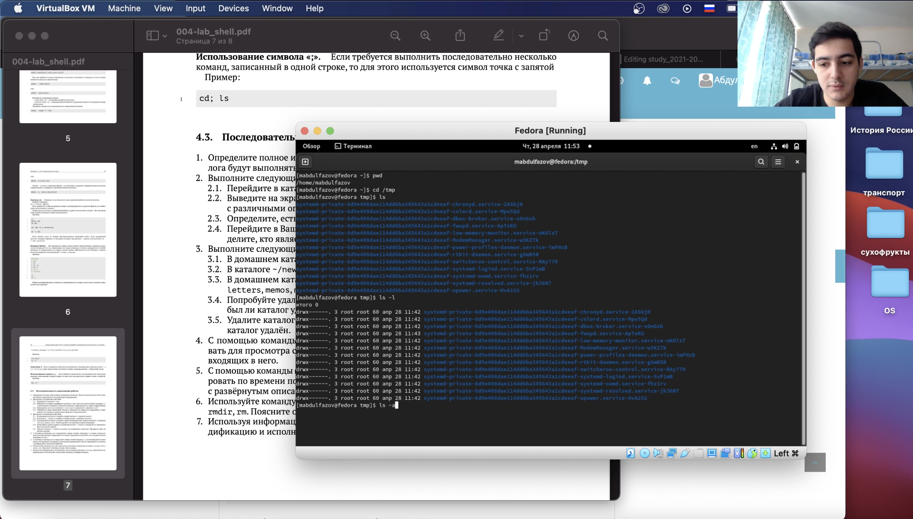{ #fig:002 width=70% }

##

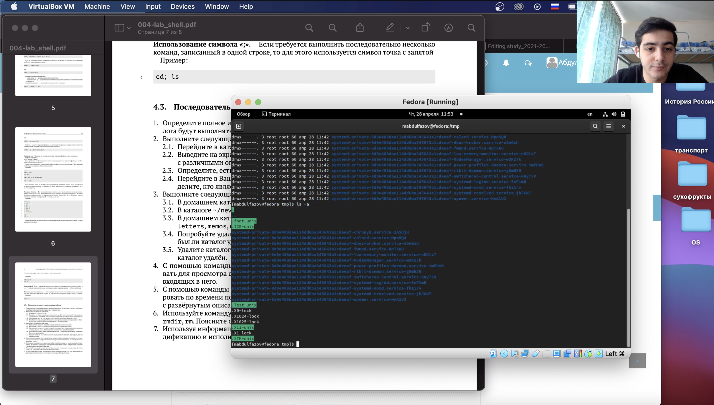{ #fig:003 width=70% }

##

3. Определил, есть ли в каталоге/var/spool подкаталог с именем cron. (рис. 4)

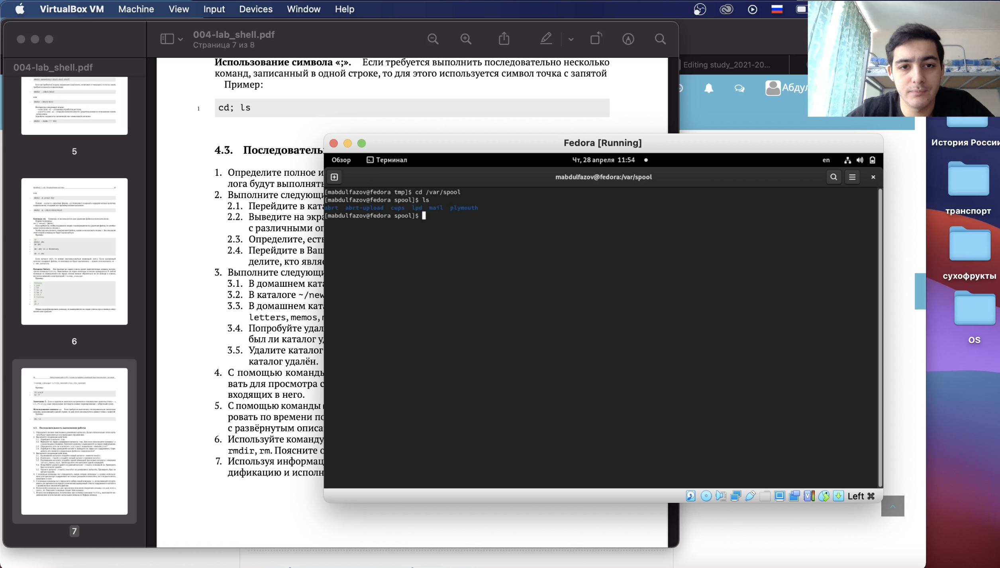{ #fig:004 width=70% }

##

4. Перешёл в домашний каталог и вывел на экран его содержимое с помощью команды ls. А с помощью команды ls -l определил владельца файлов и подкаталогов. (рис. 5)

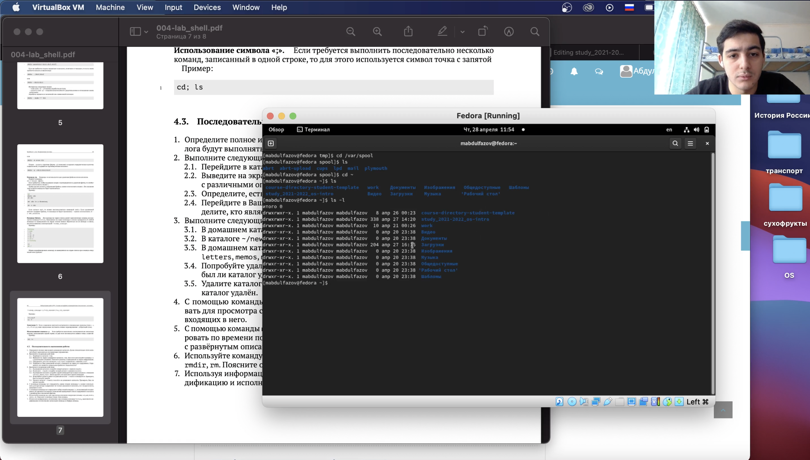{ #fig:005 width=70% }

##

5. В домашнем каталоге создал новый каталог с именем newdir. (рис. 6)

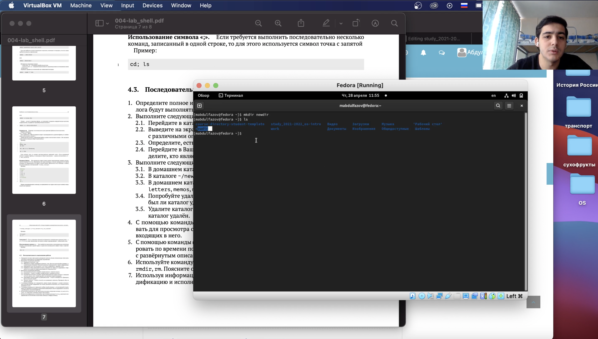{ #fig:006 width=70% }

##

6. В каталоге newdir создал новый каталог с именем morefun с помощью команды mkdir. (рис. 7)

{ #fig:007 width=70% }

##

7. В домашнем каталоге создал три новых каталога с именами letters, memos, misk одной командой "mkdir". А затем удалил эти три каталога одной командой "rmdir" (рис. 8)

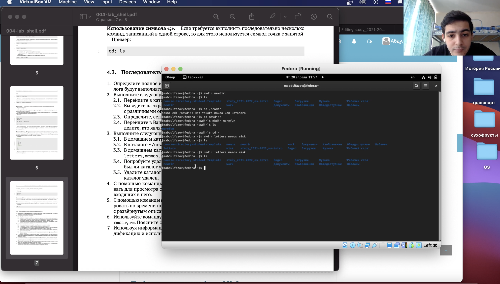{ #fig:008 width=70% }

##

8. Попробовал удалить ранее созданный каталог newdir с помощью команды "rm", но ничего не вышло, так как команда "rm" предназначена для удаления файлов. А затем удалил каталок morefun c помощью команды "rmdir".  (рис. 9)

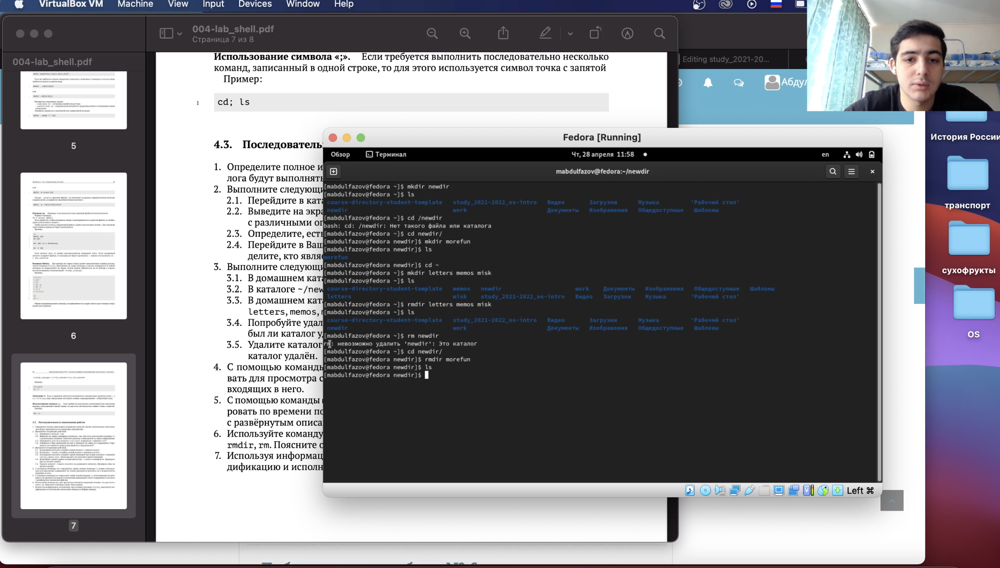{ #fig:009 width=70% }

##

9. С помощью команды "man" определил какую опцию команды ls нужно использовать для  просмотра содержимого не только указанного каталога, но и подкаталогов, входящих в него. Ответ : этой опцией команды является -R. (рис. 10)

{ #fig:010 width=70% }

##

10. С помощью команды "man" определил какую опцию команды ls позволяет отсортировать по времени последнего изменения выводимый список содержимого каталога с развёрнутым описанием файлов. Ответ : этой опцией команды является -t. (рис. 11)

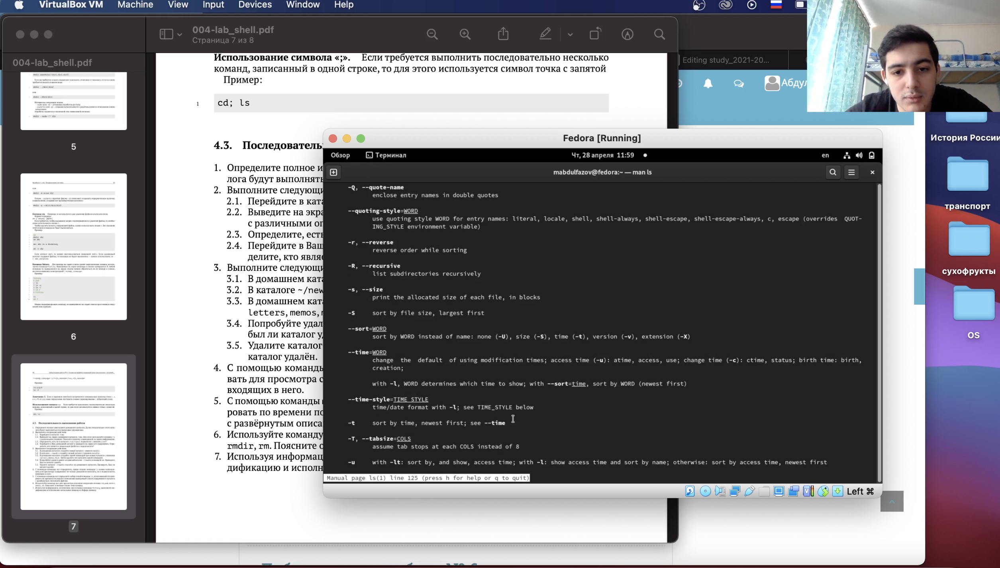{ #fig:011 width=70% }

##

11. Использовал команду man для просмотра описания следующих команд: cd, pwd, mkdir, rmdir, rm. (рис. 12, рис. 13, рис. 14, рис. 15, рис. 16)

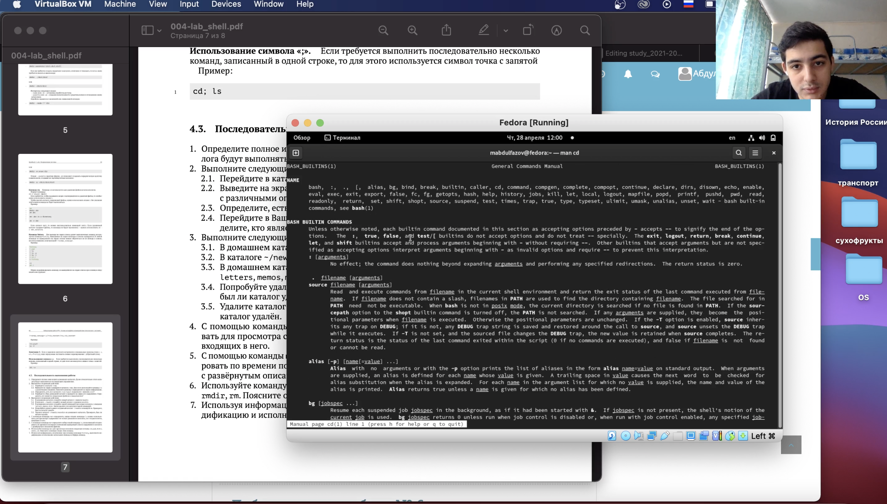{ #fig:012 width=70% }

##

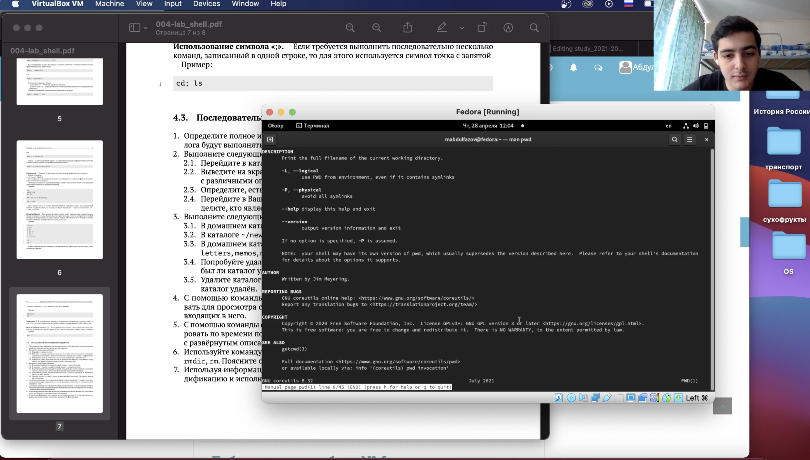{ #fig:013 width=70% }

##

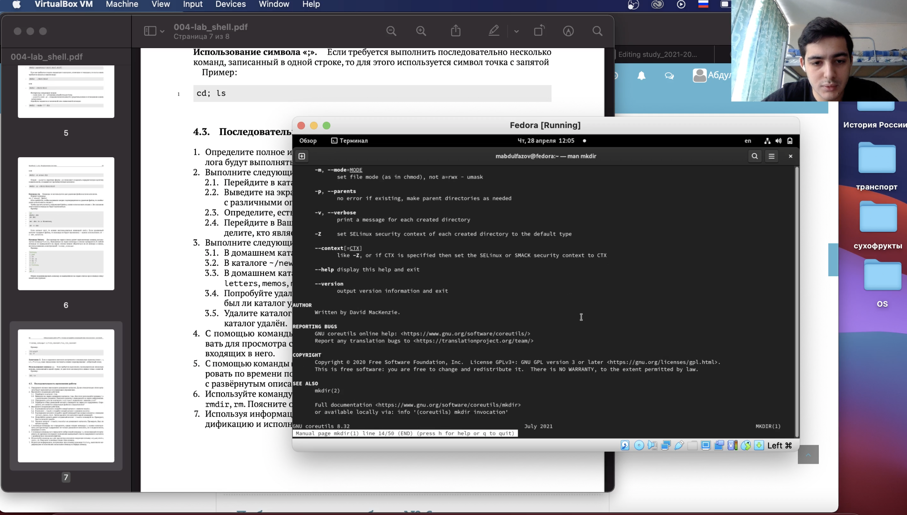{ #fig:014 width=70% }

##

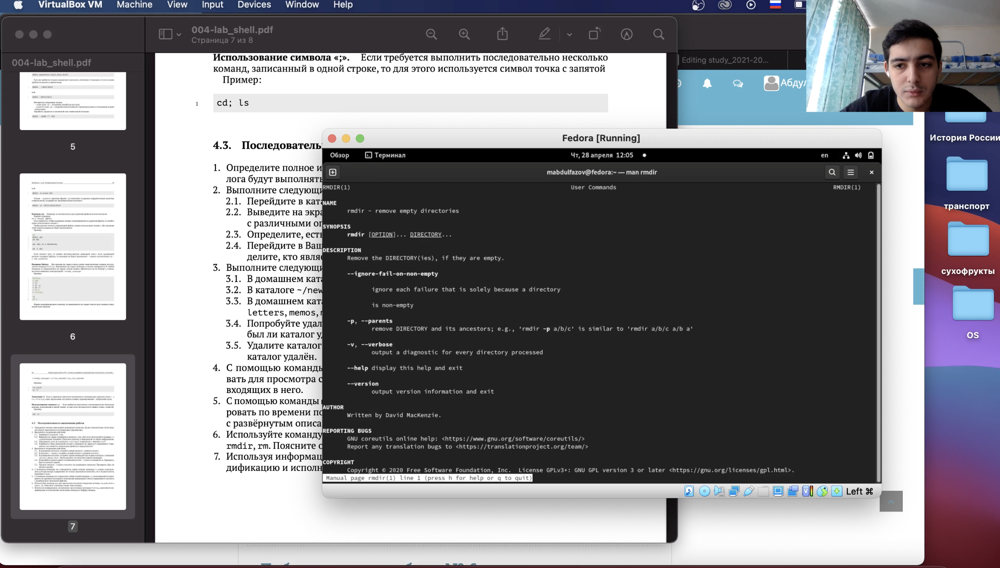{ #fig:015 width=70% }

##

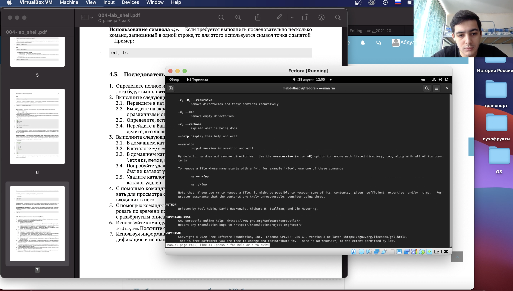{ #fig:016 width=70% }

##

12. Использовал команду  "history" для получения информации об истории ввода команд и выполнил модификацию и исполнение некоторых из них. (рис. 17 и рис. 18)

{ #fig:017 width=70% }

##

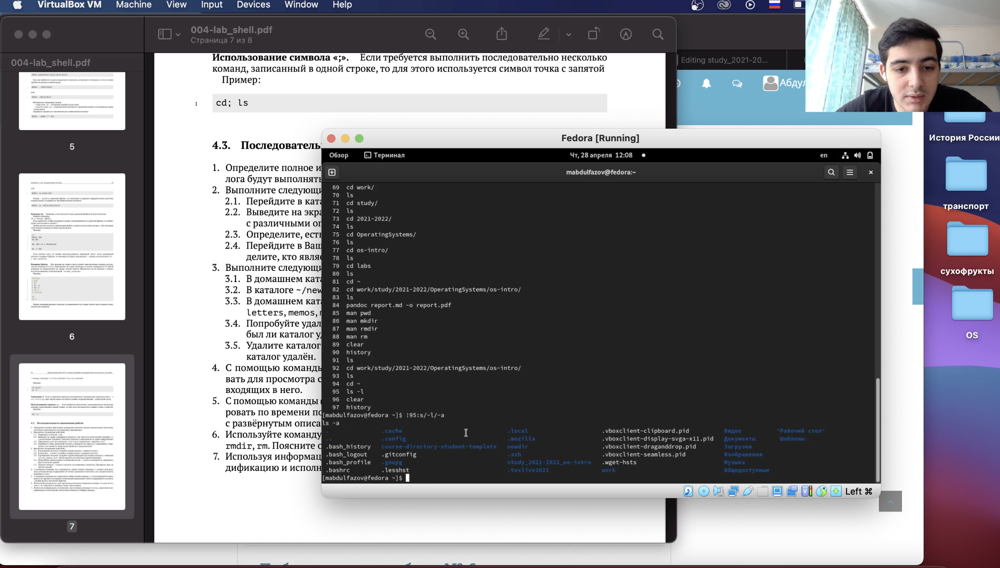{ #fig:018 width=70% }

## Вывод

Приобрёл практические навыки взаимодействия пользователя с системой посредством командной строки.

