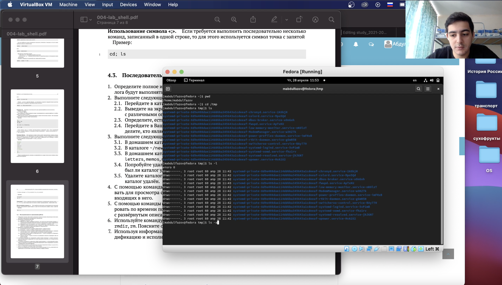

---
# Front matter
lang: ru-RU
title: "Лабораторная работа 4"
subtitle: "Основы интерфейса взаимодействия пользователя с системой Unix на уровне командной строки"
author: "Абдулфазов Мансур Али оглы"

# Formatting
toc-title: "Содержание"
toc: true # Table of contents
toc_depth: 2
fontsize: 12pt
linestretch: 1.5
papersize: a4paper
documentclass: scrreprt
polyglossia-lang: russian
polyglossia-otherlangs: english
mainfont: PT Serif
romanfont: PT Serif
sansfont: PT Sans
monofont: PT Mono
mainfontoptions: Ligatures=TeX
romanfontoptions: Ligatures=TeX
sansfontoptions: Ligatures=TeX,Scale=MatchLowercase
monofontoptions: Scale=MatchLowercase
indent: true
pdf-engine: lualatex
header-includes:
  - \linepenalty=10 # the penalty added to the badness of each line within a paragraph (no associated penalty node) Increasing the value makes tex try to have fewer lines in the paragraph.
  - \interlinepenalty=0 # value of the penalty (node) added after each line of a paragraph.
  - \hyphenpenalty=50 # the penalty for line breaking at an automatically inserted hyphen
  - \exhyphenpenalty=50 # the penalty for line breaking at an explicit hyphen
  - \binoppenalty=700 # the penalty for breaking a line at a binary operator
  - \relpenalty=500 # the penalty for breaking a line at a relation
  - \clubpenalty=150 # extra penalty for breaking after first line of a paragraph
  - \widowpenalty=150 # extra penalty for breaking before last line of a paragraph
  - \displaywidowpenalty=50 # extra penalty for breaking before last line before a display math
  - \brokenpenalty=100 # extra penalty for page breaking after a hyphenated line
  - \predisplaypenalty=10000 # penalty for breaking before a display
  - \postdisplaypenalty=0 # penalty for breaking after a display
  - \floatingpenalty =20000 # penalty for splitting an insertion (can only be split footnote in standard LaTeX)
  - \raggedbottom # or \flushbottom
  - \usepackage{float} # keep figures where there are in the text
  - \floatplacement{figure}{H} # keep figures where there are in the text
---

# Цель работы

Приобретение практических навыков взаимодействия пользователя с системой по\- средством командной строки.

# Задание 

1.  Определитеполноеимявашегодомашнегокаталога.Далееотносительноэтогоката\- лога будут выполняться последующие упражнения.
    
2.  Выполнитеследующиедействия:
    
      2.1.  Перейдитевкаталог/tmp.
        
      2.2.  Выведитенаэкрансодержимоекаталога/tmp.Дляэтогоиспользуйтекомандуls
        
        с различными опциями. Поясните разницу в выводимой на экран информации.
        
      2.3.  Определите,естьливкаталоге/var/spoolподкаталогсименемcron?
        
      2.4.  ПерейдитевВашдомашнийкаталогивыведитенаэкранегосодержимое.Опре-
        
        делите, кто является владельцем файлов и подкаталогов?
        
3.  Выполнитеследующиедействия:
    
      3.1.  Вдомашнемкаталогесоздайтеновыйкаталогсименемnewdir.
        
      3.2.  Вкаталоге~/newdirсоздайтеновыйкаталогсименемmorefun.
        
      3.3.  Вдомашнемкаталогесоздайтеоднойкомандойтриновыхкаталогасименами
        
        letters, memos, misk. Затем удалите эти каталоги одной командой.
        
      3.4.  Попробуйтеудалитьранеесозданныйкаталог~/newdirкомандойrm.Проверьте,
        
        был ли каталог удалён.
        
      3.5.  Удалитекаталог~/newdir/morefunиздомашнегокаталога.Проверьте,былли
        
        каталог удалён.
        
4.  С помощью команды man определите, какую опцию команды ls нужно использо-
    
    вать для просмотра содержимое не только указанного каталога, но и подкаталогов,
    
    входящих в него.
    
5.  Спомощьюкомандыmanопределитенаборопцийкомандыls,позволяющийотсорти-
    
    ровать по времени последнего изменения выводимый список содержимого каталога
    
    с развёрнутым описанием файлов.
    
6.  Используйтекомандуmanдляпросмотраописанияследующихкоманд:cd,pwd,mkdir,
    
    rmdir, rm. Поясните основные опции этих команд.
    
7.  Используяинформацию,полученнуюприпомощикомандыhistory,выполнитемо-
    
    дификацию и исполнение нескольких команд из буфера команд.

# Выполнение лабораторной работы

1. Определил полное имя своего домашнего каталога. (рис. 1)

{ #fig:001 width=70% }

2. Перешёл в каталог /tmp. Вывел на экран содержимое каталога с помощью команды ls. (рис. 2 и рис. 3)

{ #fig:002 width=70% }

{ #fig:003 width=70% }

3. Определил, есть ли в каталоге/var/spool подкаталог с именем cron. (рис. 4)

{ #fig:004 width=70% }

4. Перешёл в домашний каталог и вывел на экран его содержимое с помощью команды ls. А с помощью команды ls -l определил владельца файлов и подкаталогов. (рис. 5)

{ #fig:005 width=70% }

5. В домашнем каталоге создал новый каталог с именем newdir. (рис. 6)

{ #fig:006 width=70% }

6. В каталоге newdir создал новый каталог с именем morefun с помощью команды mkdir. (рис. 7)

{ #fig:007 width=70% }

7. В домашнем каталоге создал три новых каталога с именами letters, memos, misk одной командой "mkdir". А затем удалил эти три каталога одной командой "rmdir" (рис. 8)

{ #fig:008 width=70% }

8. Попробовал удалить ранее созданный каталог newdir с помощью команды "rm", но ничего не вышло, так как команда "rm" предназначена для удаления файлов. А затем удалил каталок morefun c помощью команды "rmdir".  (рис. 9)

{ #fig:009 width=70% }

9. С помощью команды "man" определил какую опцию команды ls нужно использовать для  просмотра содержимого не только указанного каталога, но и подкаталогов, входящих в него. Ответ : этой опцией команды является -R. (рис. 10)

{ #fig:010 width=70% }

10. С помощью команды "man" определил какую опцию команды ls позволяет отсортировать по времени последнего изменения выводимый список содержимого каталога с развёрнутым описанием файлов. Ответ : этой опцией команды является -t. (рис. 11)

{ #fig:011 width=70% }

11. Использовал команду man для просмотра описания следующих команд: cd, pwd, mkdir, rmdir, rm. (рис. 12, рис. 13, рис. 14, рис. 15, рис. 16)

{ #fig:012 width=70% }

{ #fig:013 width=70% }

{ #fig:014 width=70% }

{ #fig:015 width=70% }

{ #fig:016 width=70% }

12. Использовал команду  "history" для получения информации об истории ввода команд и выполнил модификацию и исполнение некоторых из них. (рис. 17 и рис. 18)

{ #fig:017 width=70% }

{ #fig:018 width=70% }

# Вывод

Приобрёл практические навыки взаимодействия пользователя с системой посредством командной строки.

# Контрольные вопросы

1. Что такое командная строка?
Командная строка – пользовательский интерфейс, обеспечивающий взаимодействия пользователя с системой.

2. При помощи какой команды можно определить абсолютный путь текущего каталога? Приведите пример.
Абсолютный путь текущего каталога определяется с помощью команды pwd. (рис. 19)

{ #fig:001 width=70% }

3. При помощи какой команды и каких опций можно определить только тип файлов и их имена в текущем каталоге? 
    Тип файлов и их имена можно узнать с помощью команды ls с опцией –F. (рис. 20)
    
   { #fig:021 width=70% }

4. Каким образом отобразить информацию о скрытых файлах? Приведите примеры.
Информацию о скрытых файлах можно отобразить с помощью команды ls –a. имена таких файлов начинаются с точки.  (рис. 21)

{ #fig:003 width=70% }

5. При помощи каких команд можно удалить файл и каталог? Можно ли это сделать одной и той же командой? Приведите примеры.
Файл удаляется с помощью команды rm. При указании опции –r можно рекурсивно удалить каталог вместе с содержимым. Если каталог пуст, то можно использовать команду rmdir. (рис. 22 и рис. 23)

{ #fig:009 width=70% }

{ #fig:020 width=70% }

6. Каким образом можно вывести информацию о последних выполненных пользователем командах? 
Информацию о последних выполненных командах можно получить, введя команду history.

7. Как воспользоваться историей команд для их модифицированного выполнения? Приведите примеры.
Для модифицированного выполнения команд из истории можно при помощи следующей конструкции: !<номер_команды>:s/<что_меняем>/<на_что_меняем>. (рис. 24)

{ #fig:018 width=70% }

8. Приведите примеры запуска нескольких команд в одной строке. (рис. 25)

{ #fig:019 width=70% }

10. Дайте определение и приведите примера символов экранирования.
Если в заданном контексте встречаются специальные символы (типа «.»,
«/», «*» и т.д.), надо перед ними поставить символ экранирования \ (обратный слэш).

10. Охарактеризуйте вывод информации на экран после выполнения команды ls с опцией l.
В результате выполнения команды ls –l на экран выводится следующая информация о файлах и директориях: 
-	тип файла;
-	права доступа;
-	число ссылок;
-	владелец;
-	размер;
-	дата последней ревизии;
-	имя файла или каталога.

11. Что такое относительный путь к файлу? Приведите примеры использования относительного и абсолютного пути при выполнении какой-либо команды.
Относительный путь к файлу – путь, начинающийся от текущей директории.
Пример абсолютного пути:
/home/pl/Desktop/boot/etc/vim, всегда начинается со /

Пример относительного пути:
./images_lab4/18.png, начинается либо с одной точки, либо с двух

12. Как получить информацию об интересующей вас команде?
Информацию об интересующей команде можно получить с помощью команды man.

13. Какая клавиша или комбинация клавиш служит для автоматического дополнения вводимых команд?
Клавиша Tab служит для автоматического дополнения вводимых команд.

