---
## Front matter
lang: ru-RU
title: Анализ файловой системы Linux. Команды для работы с файлами и каталогами
author: Мансур А. о. Абдулфазов\inst{1,3}
        Группа НФИбд-01-21
date: 4 Мая, 2021, Россия, Москва

## Formatting
toc: false
slide_level: 2
theme: metropolis
header-includes: 
 - \metroset{progressbar=frametitle,sectionpage=progressbar,numbering=fraction}
 - '\makeatletter'
 - '\beamer@ignorenonframefalse'
 - '\makeatother'
aspectratio: 43
section-titles: true
---

## Цель работы

Ознакомление с файловой системой Linux, её структурой, именами и содержанием каталогов. Приобретение практических навыков по применению команд для работы с файлами и каталогами, по управлению процессами (и работами), по проверке исполь- зования диска и обслуживанию файловой системы.

## Выполнение лабораторной работы

1. Выполните все примеры, приведённые в первой части описания лабораторной работы. (рис. 1)

{#fig:001 width=70%}

##

2. Скопируйте файл /usr/include/sys/io.h в домашний каталог и назовите его equipment. (рис. 2)

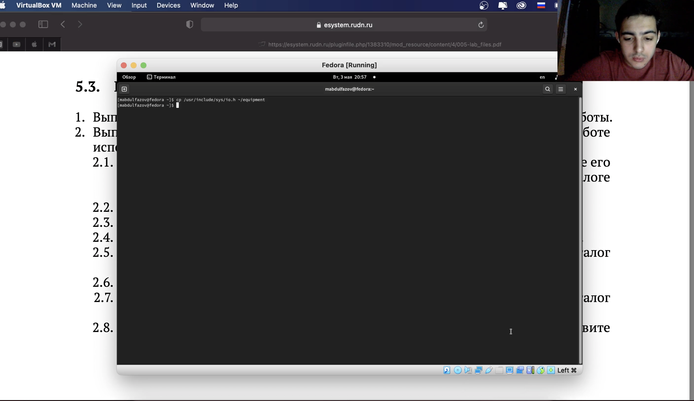{#fig:002 width=70%}

##

3. В домашнем каталоге создал директорию~/ski.plases. Переместил файл equipment  в каталог ~/ski.plases. (рис. 3)

{#fig:003 width=70%}

##

4.  В домашнем каталоге создайте директорию~/ski.plases. Переместите файл equipment  в каталог ~/ski.plases. Переименуйте файл ~/ski.plases/equipment в ~/ski.plases/equiplist. (рис. 4)

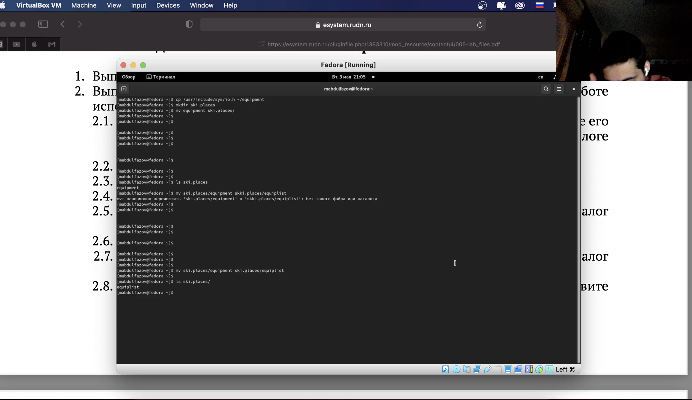{#fig:004 width=70%}

##

5. Создал в домашнем каталоге файл abc1 и скопировал его в каталог ~/ski.plases, назвал его equiplist2. (рис. 5)

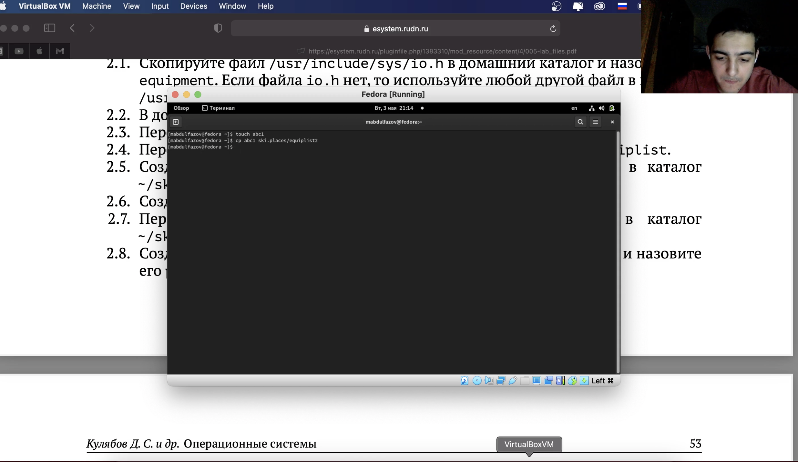{#fig:005 width=70%}

##

6.  Создал каталог с именем equipment в каталоге ~/ski.plases. Переместил файлы ~/ski.plases/equiplist и equiplist2 в каталог ~/ski.plases/equipment. (рис. 6)

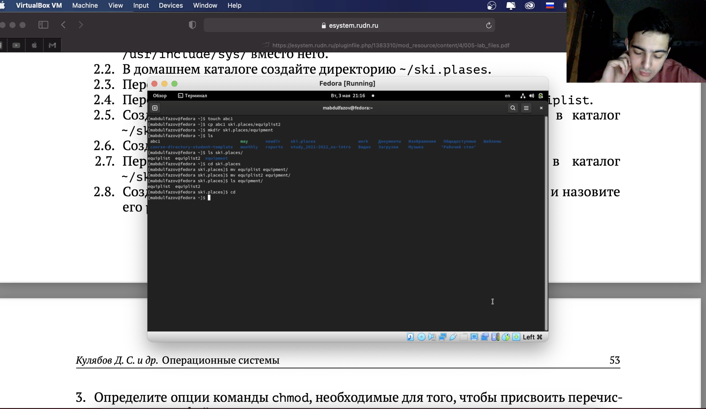{#fig:006 width=70%}

##

7. Создал и переместил каталог ~/newdir в каталог ~/ski.plases и назвал
его plans. (рис. 7)

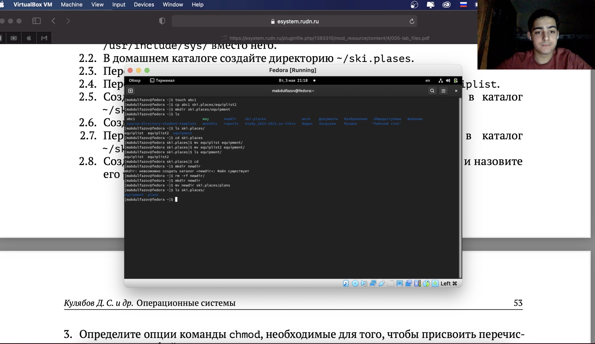{#fig:007 width=70%}

##

8.  С помощью команды chmod изменил права доступа, данные по заданию, к следующим файлам (рис. 8)

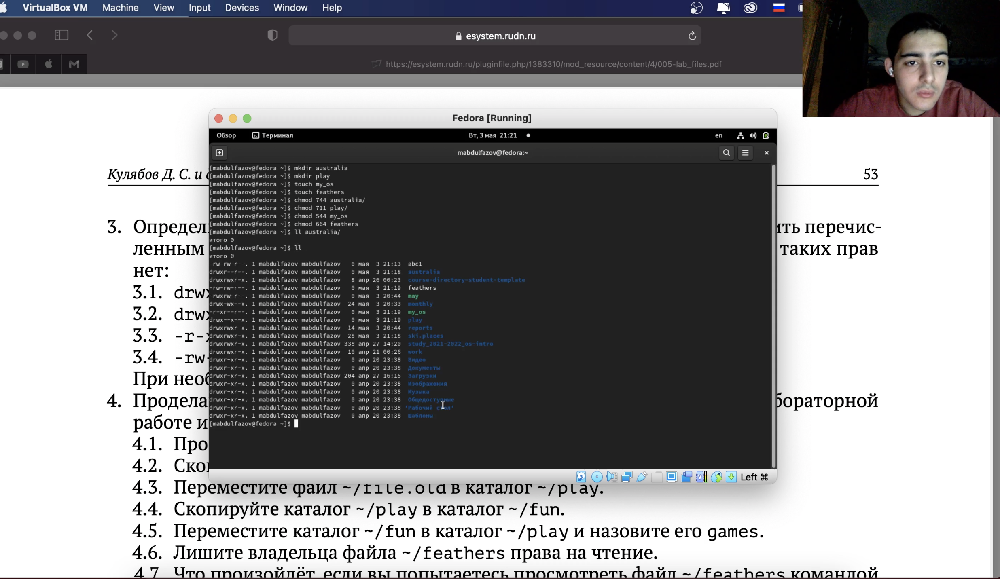{#fig:008 width=70%}

##

9.  С помощью команды cat просмотрел содержимое файла /etc/password (рис. 9)

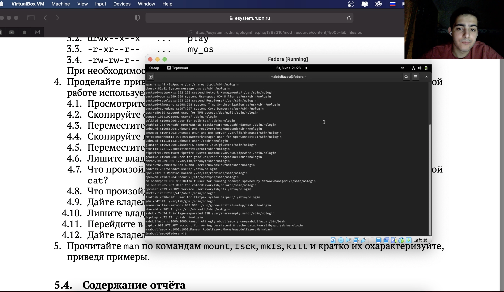{#fig:009 width=70%}

##

10. Скопировал файл ~/feathers в файл ~/file.old. Переместил файл ~/file.old в каталог ~/play. Скопировал каталог ~/play в каталог ~/fun. Переместил каталог ~/fun в каталог ~/play и назвал его games. (рис. 10)

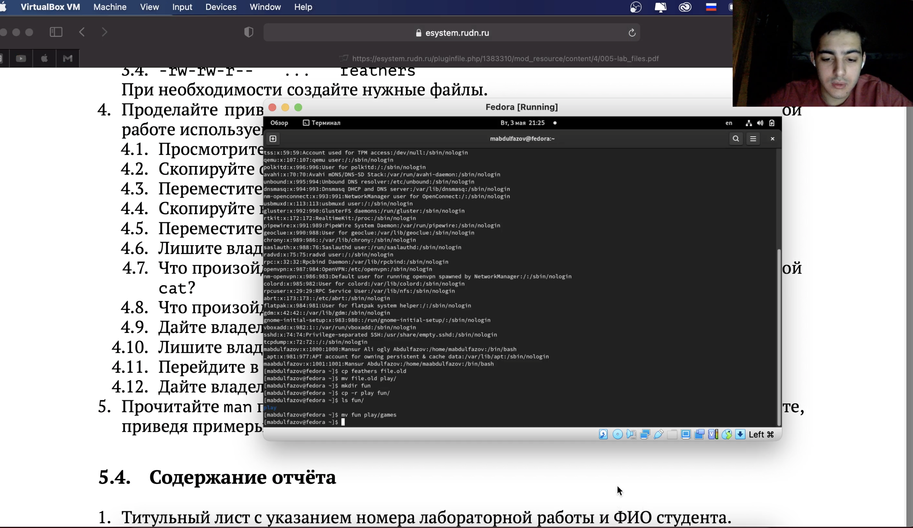{#fig:010 width=70%}

##

11. Лишил владельца файла ~/feathers права на чтение. Попытался просмотреть файл ~/feathers командой cat. Попытался скопировать файл ~/feathers. Дал владельцу файла ~/feathers право на чтение. (рис. 11)

{#fig:011 width=70%}

##

12. Лишил владельца каталога ~/play права на выполнение. Попытался перейти в каталог ~/play. Дал владельцу каталога ~/play право на выполнение. (рис. 12)

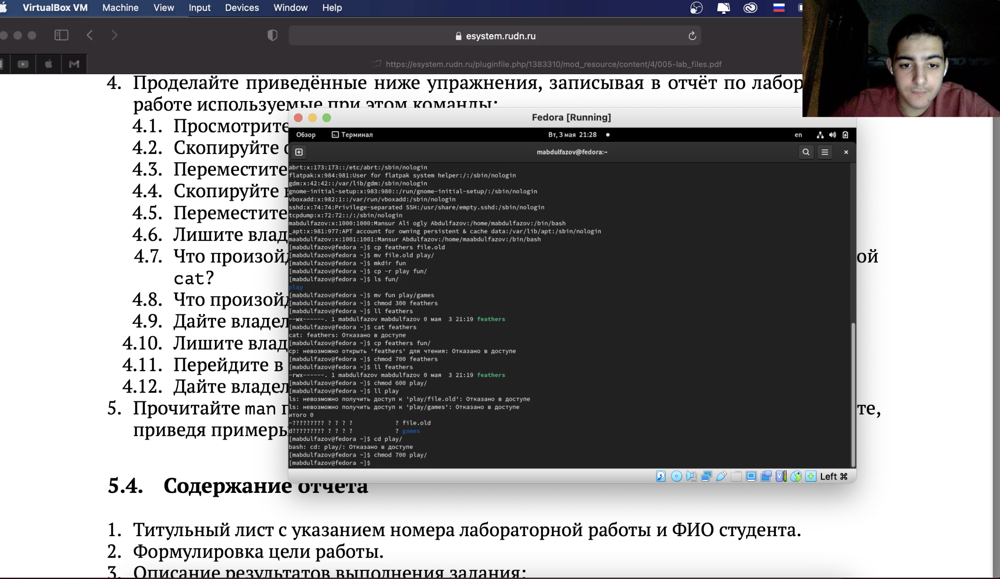{#fig:012 width=70%}

##

13. Прочитал man по командам mount, fsck, mkfs, kill (рис. 13, рис. 14, рис. 15, рис. 16)

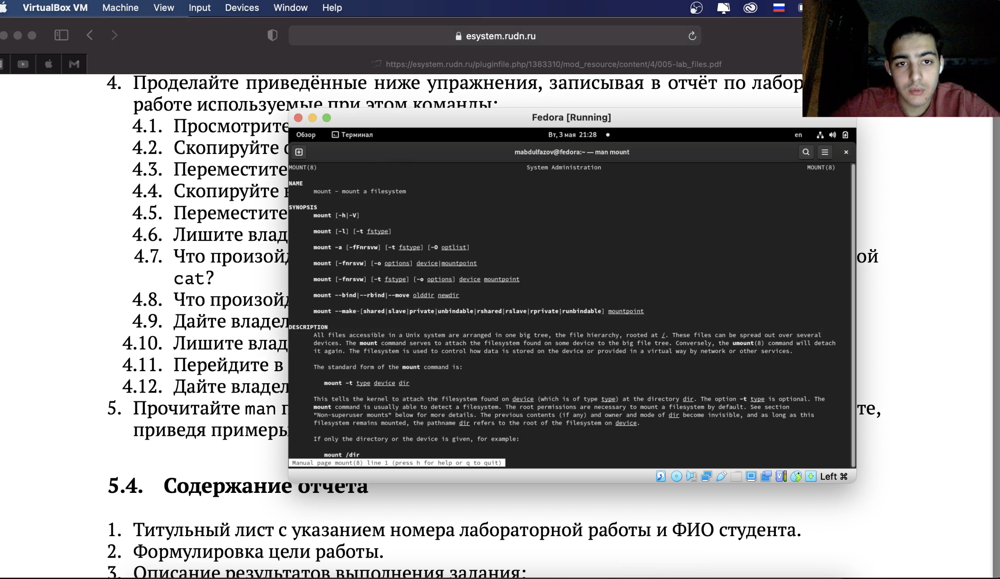{#fig:013 width=70%}

##

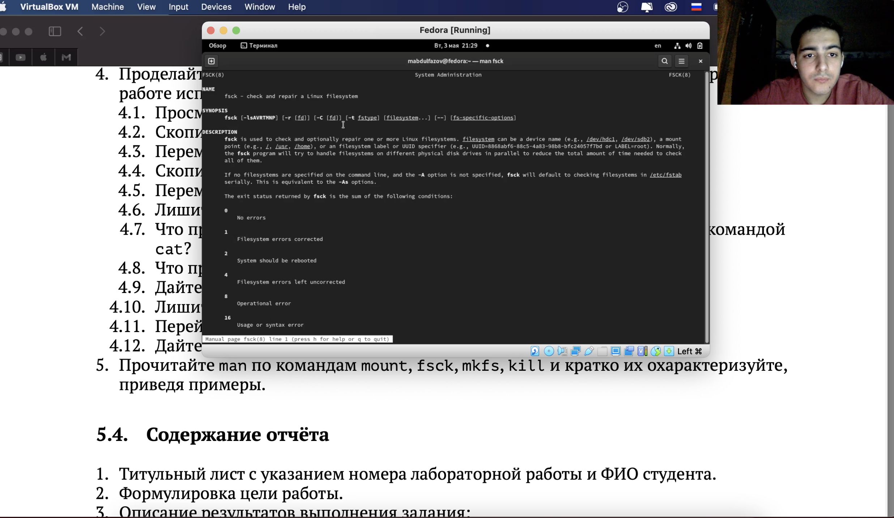{#fig:014 width=70%}

##

{#fig:015 width=70%}

##

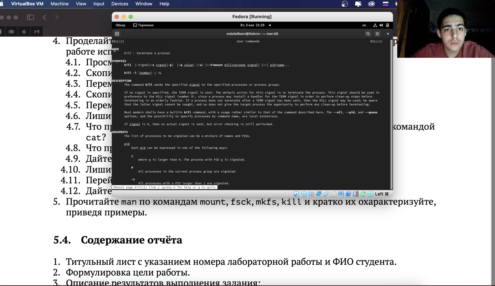{#fig:016 width=70%}

## Вывод

Ознакомился с файловой системой Linux, её структурой, именами и содержанием каталогов. Приобрёл практические навыки по применению команд для работы с файлами и каталогами, по управлению процессами (и работами), по проверке использования диска и обслуживанию файловой системы.

