---
# Front matter
lang: ru-RU
title: "Лабораторная работа 5"
subtitle: "Анализ файловой системы Linux. Команды для работы с файлами и каталогами"
author: "Абдулфазов Мансур Али оглы"

# Formatting
toc-title: "Содержание"
toc: true # Table of contents
toc_depth: 2
fontsize: 12pt
linestretch: 1.5
papersize: a4paper
documentclass: scrreprt
polyglossia-lang: russian
polyglossia-otherlangs: english
mainfont: PT Serif
romanfont: PT Serif
sansfont: PT Sans
monofont: PT Mono
mainfontoptions: Ligatures=TeX
romanfontoptions: Ligatures=TeX
sansfontoptions: Ligatures=TeX,Scale=MatchLowercase
monofontoptions: Scale=MatchLowercase
indent: true
pdf-engine: lualatex
header-includes:
  - \linepenalty=10 # the penalty added to the badness of each line within a paragraph (no associated penalty node) Increasing the value makes tex try to have fewer lines in the paragraph.
  - \interlinepenalty=0 # value of the penalty (node) added after each line of a paragraph.
  - \hyphenpenalty=50 # the penalty for line breaking at an automatically inserted hyphen
  - \exhyphenpenalty=50 # the penalty for line breaking at an explicit hyphen
  - \binoppenalty=700 # the penalty for breaking a line at a binary operator
  - \relpenalty=500 # the penalty for breaking a line at a relation
  - \clubpenalty=150 # extra penalty for breaking after first line of a paragraph
  - \widowpenalty=150 # extra penalty for breaking before last line of a paragraph
  - \displaywidowpenalty=50 # extra penalty for breaking before last line before a display math
  - \brokenpenalty=100 # extra penalty for page breaking after a hyphenated line
  - \predisplaypenalty=10000 # penalty for breaking before a display
  - \postdisplaypenalty=0 # penalty for breaking after a display
  - \floatingpenalty =20000 # penalty for splitting an insertion (can only be split footnote in standard LaTeX)
  - \raggedbottom # or \flushbottom
  - \usepackage{float} # keep figures where there are in the text
  - \floatplacement{figure}{H} # keep figures where there are in the text
---

# Цель работы

Ознакомление с файловой системой Linux, её структурой, именами и содержанием каталогов. Приобретение практических навыков по применению команд для работы с файлами и каталогами, по управлению процессами (и работами), по проверке исполь- зования диска и обслуживанию файловой системы.

# Задание 

1. Выполните все примеры, приведённые в первой части описания лабораторной работы.
2. Выполните следующие действия, зафиксировав в отчёте по лабораторной работе
используемые при этом команды и результаты их выполнения:
2.1. Скопируйтефайл/usr/include/sys/io.hвдомашнийкаталогиназовитеего equipment. Если файла io.h нет, то используйте любой другой файл в каталоге
/usr/include/sys/ вместо него.
2.2. В домашнем каталоге создайте директорию~/ski.plases.
2.3. Переместите файл equipment  в каталог ~/ski.plases.
2.4. Переименуйтефайл~/ski.plases/equipmentв~/ski.plases/equiplist.
2.5. Создайте в домашнем каталоге файл abc1 и скопируйте его в каталог
~/ski.plases, назовите его equiplist2.
2.6. Создайтека талог с именем equipment в каталоге ~/ski.plases.
2.7. Переместите файлы ~/ski.plases/equiplist и equiplist2 в каталог
~/ski.plases/equipment.
2.8. Создайте и переместите каталог ~/newdir в каталог ~/ski.plases и назовите
его plans.
 3. Определите опции команды chmod, необходимые для того, чтобы присвоить перечисленным ниже файлам выделенные права доступа, считая, что в начале таких прав нет:
3.1. drwxr--r--
...   australia
...   play
...   my_os
...   feathers
3.2. drwx--x--x
3.3. -r-xr--r--
3.4. -rw-rw-r--
При необходимости создайте нужные файлы.
4. Проделайте приведённые ниже упражнения, записывая в отчёт по лабораторной работе используемые при этом команды:
4.1. Просмотритесодержимоефайла/etc/password.
4.2. Скопируйтефайл~/feathersвфайл~/file.old.
4.3. Переместитефайл~/file.oldвкаталог~/play.
4.4. Скопируйтекаталог~/playвкаталог~/fun.
4.5. Переместитекаталог~/funвкаталог~/playиназовитеегоgames.
4.6. Лишитевладельцафайла~/feathersправаначтение.
4.7. Чтопроизойдёт,есливыпопытаетесьпросмотретьфайл~/feathersкомандой
cat?
4.8. Чтопроизойдёт,есливыпопытаетесьскопироватьфайл~/feathers?
4.9. Дайтевладельцуфайла~/feathersправоначтение.
4.10. Лишитевладельцакаталога~/playправанавыполнение.
4.11. Перейдитевкаталог~/play.Чтопроизошло?
4.12. Дайтевладельцукаталога~/playправонавыполнение.
5. Прочитайтеmanпокомандамmount,fsck,mkfs,killикраткоихохарактеризуйте, приведя примеры.

# Выполнение лабораторной работы

1. Выполните все примеры, приведённые в первой части описания лабораторной работы. (рис. 1)

{#fig:001 width=70%}

2. Скопируйте файл /usr/include/sys/io.h в домашний каталог и назовите его equipment. (рис. 2)

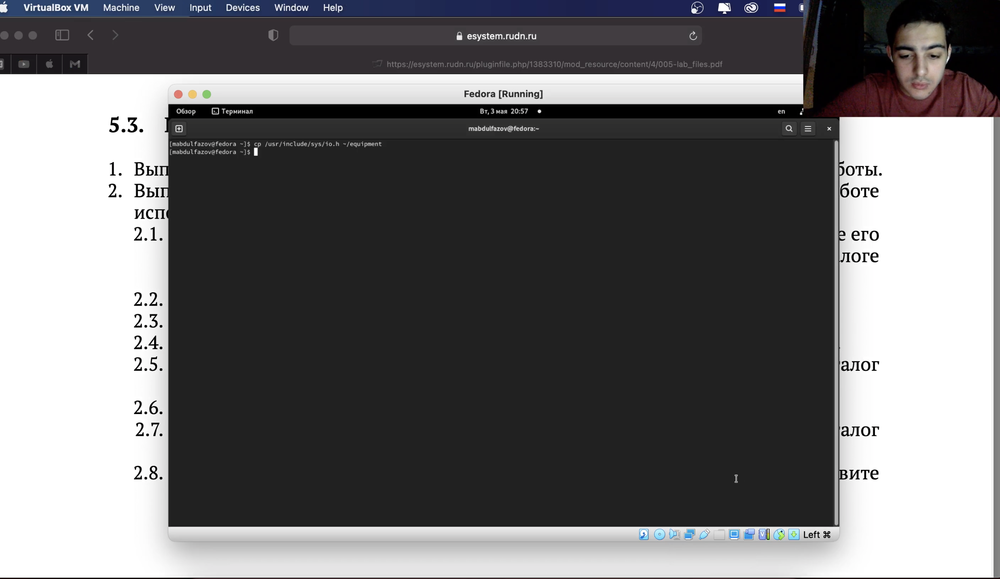{#fig:002 width=70%}

3. В домашнем каталоге создал директорию~/ski.plases. Переместил файл equipment  в каталог ~/ski.plases. (рис. 3)

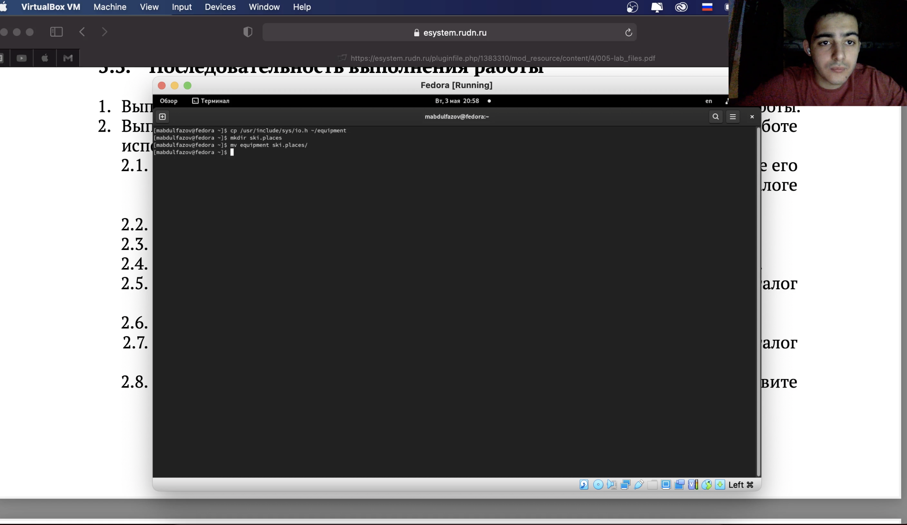{#fig:003 width=70%}

4.  В домашнем каталоге создайте директорию~/ski.plases. Переместите файл equipment  в каталог ~/ski.plases. Переименуйте файл ~/ski.plases/equipment в ~/ski.plases/equiplist. (рис. 4)

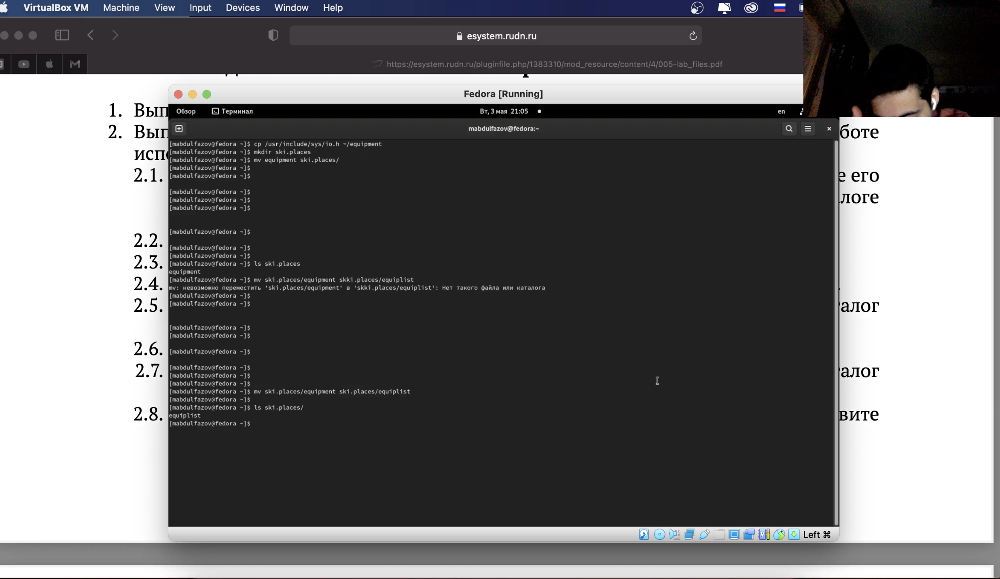{#fig:004 width=70%}

5. Создал в домашнем каталоге файл abc1 и скопировал его в каталог ~/ski.plases, назвал его equiplist2. (рис. 5)

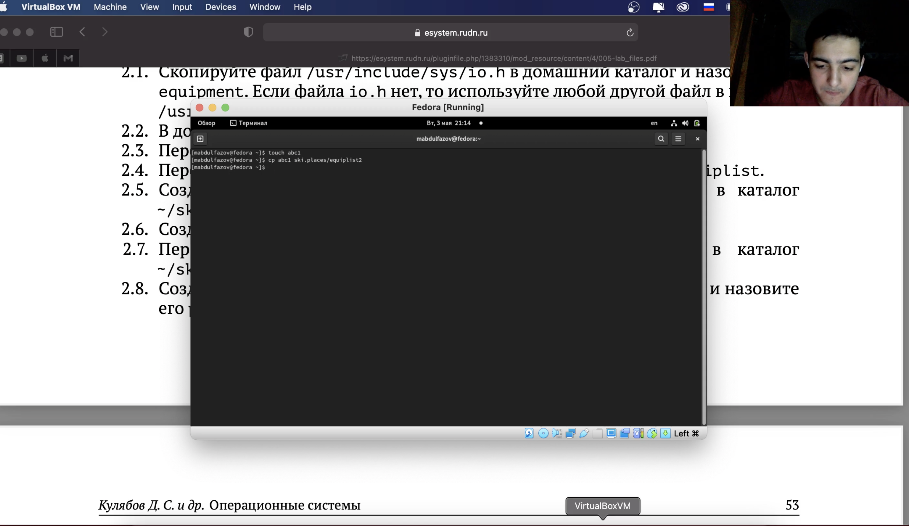{#fig:005 width=70%}

6.  Создал каталог с именем equipment в каталоге ~/ski.plases. Переместил файлы ~/ski.plases/equiplist и equiplist2 в каталог ~/ski.plases/equipment. (рис. 6)

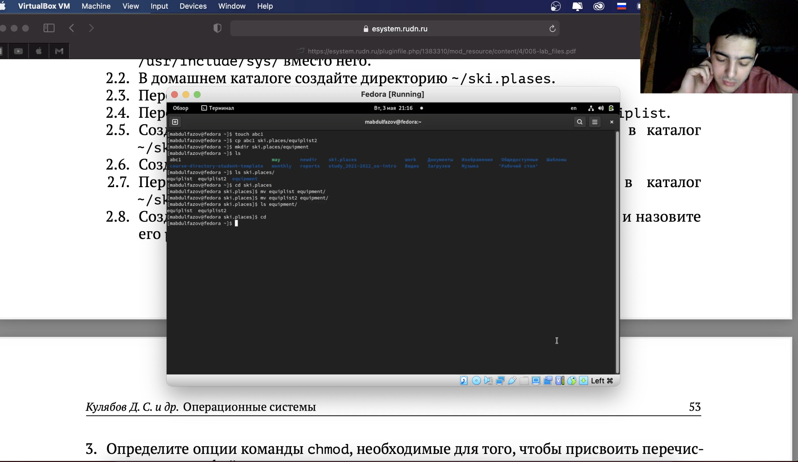{#fig:006 width=70%}

7. Создал и переместил каталог ~/newdir в каталог ~/ski.plases и назвал
его plans. (рис. 7)

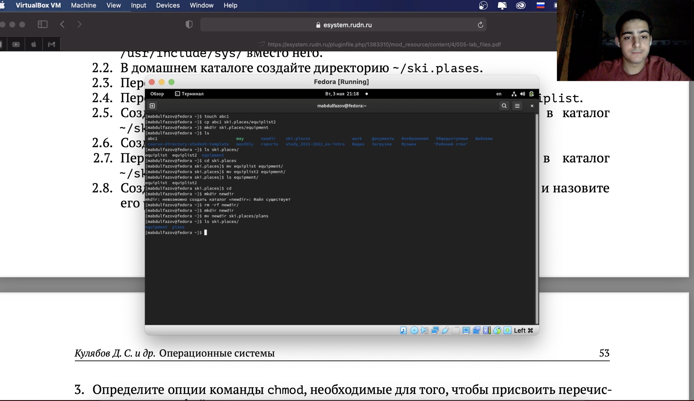{#fig:007 width=70%}

8.  С помощью команды chmod изменил права доступа, данные по заданию, к следующим файлам (рис. 8)

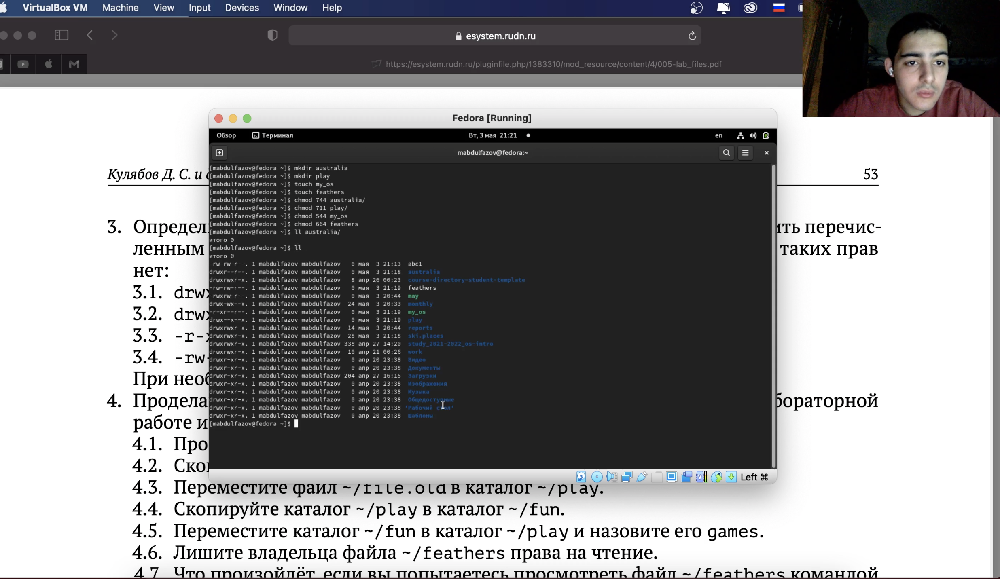{#fig:008 width=70%}

9.  С помощью команды cat просмотрел содержимое файла /etc/password (рис. 9)

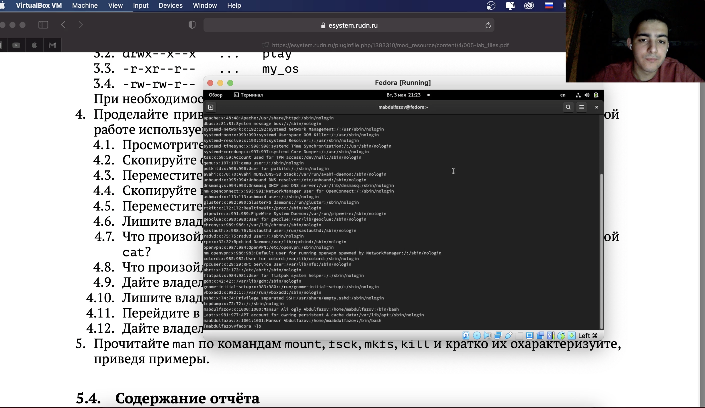{#fig:009 width=70%}

10. Скопировал файл ~/feathers в файл ~/file.old. Переместил файл ~/file.old в каталог ~/play. Скопировал каталог ~/play в каталог ~/fun. Переместил каталог ~/fun в каталог ~/play и назвал его games. (рис. 10)

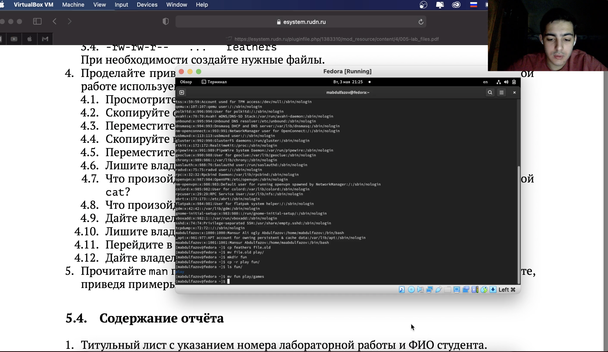{#fig:010 width=70%}

11. Лишил владельца файла ~/feathers права на чтение. Попытался просмотреть файл ~/feathers командой cat. Попытался скопировать файл ~/feathers. Дал владельцу файла ~/feathers право на чтение. (рис. 11)

{#fig:011 width=70%}

12. Лишил владельца каталога ~/play права на выполнение. Попытался перейти в каталог ~/play. Дал владельцу каталога ~/play право на выполнение. (рис. 12)

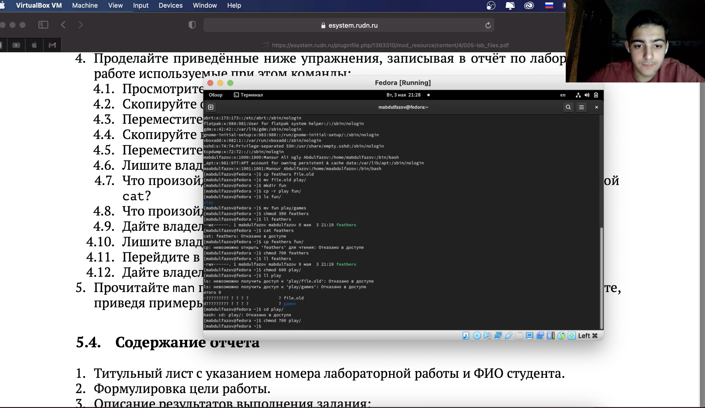{#fig:012 width=70%}

13. Прочитал man по командам mount, fsck, mkfs, kill (рис. 13, рис. 14, рис. 15, рис. 16)

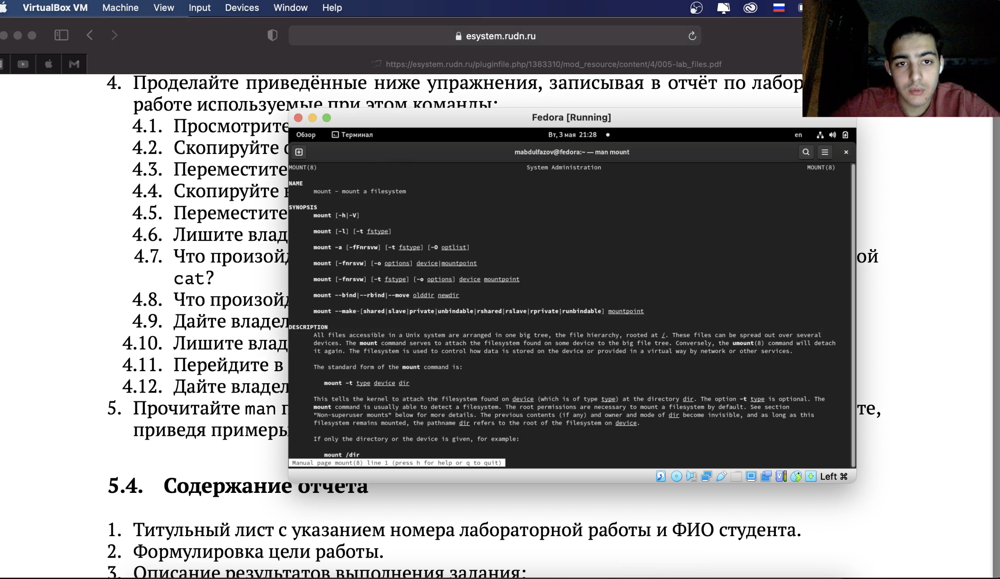{#fig:013 width=70%}

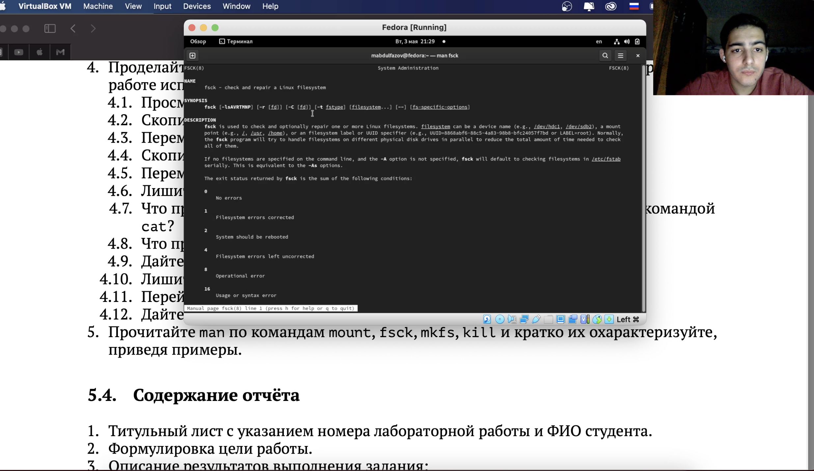{#fig:014 width=70%}

{#fig:015 width=70%}

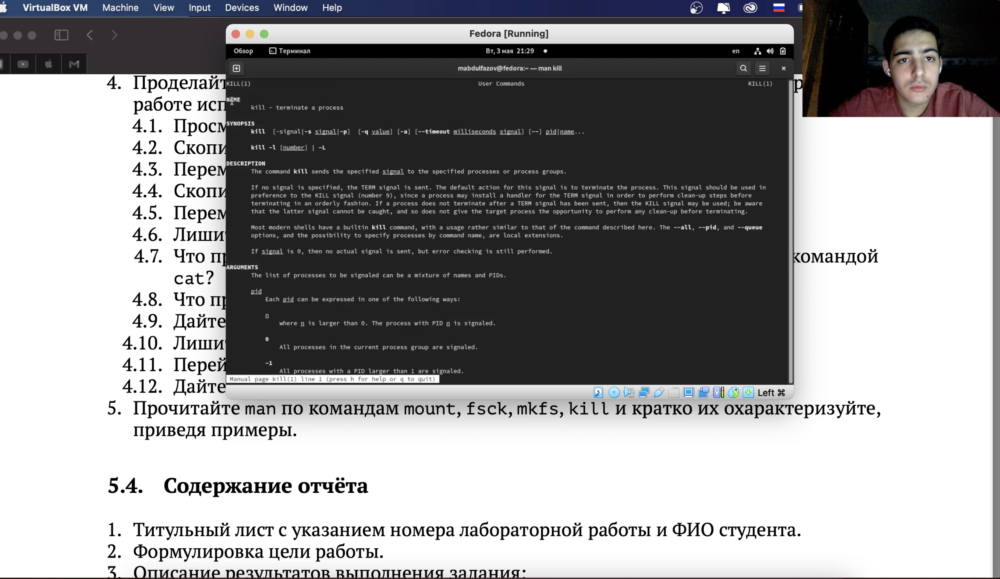{#fig:016 width=70%}

# Вывод

Ознакомился с файловой системой Linux, её структурой, именами и содержанием каталогов. Приобрёл практические навыки по применению команд для работы с файлами и каталогами, по управлению процессами (и работами), по проверке использования диска и обслуживанию файловой системы.

# Контрольные вопросы

1.	Дайте характеристику каждой файловой системе, существующей на жёстком диске компьютера, на котором вы выполняли лабораторную работу.
NTFS (аббревиатура от англ. new technology file system — «файловая система новой технологии») — стандартная файловая система для семейства операционных систем Windows NT фирмы Microsoft. NTFS поддерживает хранение метаданных. С целью улучшения производительности, надёжности и эффективности использования дискового пространства для хранения информации о файлах в NTFS используются специализированные структуры данных. Информация о файлах хранится в главной файловой таблице — Master File Table (MFT). NTFS поддерживает разграничение доступа к данным для различных пользователей и групп пользователей (списки контроля доступа — англ. access control lists, ACL), а также позволяет назначать дисковые квоты (ограничения на максимальный объём дискового пространства, занимаемый файлами тех или иных пользователей). Для повышения надёжности файловой системы в NTFS используется система журналирования USN. Для NTFS размер кластера по умолчанию составляет от 512 байт до 2 МБ в зависимости от размера тома и версии ОС.
2.	Приведите общую структуру файловой системы и дайте характеристику каждой директории первого уровня этой структуры.
/ — корневой каталог (root каталог). Содержит в себе всю иерархию системы;
/bin — здесь находятся двоичные исполняемые файлы. Основные общие команды, хранящиеся отдельно от других программ в системе (прим.: pwd, ls, cat, ps);
/boot — тут расположены файлы, используемые для загрузки системы (образ initrd, ядро vmlinuz);
/dev — в данной директории располагаются файлы устройств (драйверов). С помощью этих файлов можно взаимодействовать с устройствами. К примеру, если это жесткий диск, можно подключить его к файловой системе. В файл принтера же можно написать напрямую и отправить задание на печать;
/etc — в этой директории находятся файлы конфигураций программ. Эти файлы позволяют настраивать системы, сервисы, скрипты системных демонов;
/home — каталог, аналогичный каталогу Users в Windows. Содержит домашние каталоги учетных записей пользователей (кроме root). При создании нового пользователя здесь создается одноименный каталог с аналогичным именем и хранит личные файлы этого пользователя;
/lib — содержит системные библиотеки, с которыми работают программы и модули ядра;
/lost+found — содержит файлы, восстановленные после сбоя работы системы. Система проведет проверку после сбоя и найденные файлы можно будет посмотреть в данном каталоге;
/media — точка монтирования внешних носителей. Например, когда вы вставляете диск в дисковод, он будет автоматически смонтирован в директорию /media/cdrom;
/mnt — точка временного монтирования. Файловые системы подключаемых устройств обычно монтируются в этот каталог для временного использования;
/opt — тут расположены дополнительные (необязательные) приложения. Такие программы обычно не подчиняются принятой иерархии и хранят свои файлы в одном подкаталоге (бинарные, библиотеки, конфигурации);
/proc — содержит файлы, хранящие информацию о запущенных процессах и о состоянии ядра ОС;
/root — директория, которая содержит файлы и личные настройки суперпользователя;
/run — содержит файлы состояния приложений. Например, PID-файлы или UNIX-сокеты;
/sbin — аналогично /bin содержит бинарные файлы. Утилиты нужны для настройки и администрирования системы суперпользователем;
/srv — содержит файлы сервисов, предоставляемых сервером (прим. FTP или Apache HTTP);
/sys — содержит данные непосредственно о системе. Тут можно узнать информацию о ядре, драйверах и устройствах;
/tmp — содержит временные файлы. Данные файлы доступны всем пользователям на чтение и запись. Стоит отметить, что данный каталог очищается при перезагрузке;
/usr — содержит пользовательские приложения и утилиты второго уровня, используемые пользователями, а не системой. Содержимое доступно только для чтения (кроме root). Каталог имеет вторичную иерархию и похож на корневой;
/var — содержит переменные файлы. Имеет подкаталоги, отвечающие за отдельные переменные. Например, логи будут храниться в /var/log, кэш в /var/cache, очереди заданий в /var/spool/ и так далее.
3.	Какая операция должна быть выполнена, чтобы содержимое некоторой файловой системы было доступно операционной системе?
Монтирование тома.
4.	Назовите основные причины нарушения целостности файловой системы. Как устранить повреждения файловой системы?
Отсутствие синхронизации между образом файловой системы в памяти и ее данными на диске в случае аварийного останова может привести к появлению следующих ошибок:
Один блок адресуется несколькими mode (принадлежит нескольким файлам).
Блок помечен как свободный, но в то же время занят (на него ссылается onode).
Блок помечен как занятый, но в то же время свободен (ни один inode на него не ссылается).
Неправильное число ссылок в inode (недостаток или избыток ссылающихся записей в каталогах).
Несовпадение между размером файла и суммарным размером адресуемых inode блоков.
Недопустимые адресуемые блоки (например, расположенные за пределами файловой системы).
“Потерянные” файлы (правильные inode, на которые не ссылаются записи каталогов).
Недопустимые или неразмещенные номера inode в записях каталогов.
5.	Как создаётся файловая система?
mkfs - позволяет создать файловую систему Linux.
6.	 Дайте характеристику командам для просмотра текстовых файлов.
Cat - выводит содержимое файла на стандартное устройство вывода.
less - постраничный просмотр файлов.
7.	Приведите основные возможности команды cp в Linux.
Команда cp позволяет копировать файлы и директории в текущей директории или в другую.
8.	Приведите основные возможности команды mv в Linux.
Команда mv служит для перемещения файлов и директорий в другие директории или переименование файлов и директорий.
9.	Что такое права доступа? Как они могут быть изменены?
Права доступа – совокупность правил, которые определяют набор действий, разрешенных для выполнения субъектами над объектами данных. Права доступа к файлу или каталогу можно изменить, воспользовавшись командой chmod. Сделать это может владелец файла (или каталога) или пользователь с правами администратора.

