---
## Front matter
lang: ru-RU
title: Поиск файлов. Перенаправление ввода-вывода. Просмотр запущенных процессов
author: Мансур А. о. Абдулфазов\inst{1,3}
        Группа НФИбд-01-21
date: 7 Мая, 2021, Россия, Москва

## Formatting
toc: false
slide_level: 2
theme: metropolis
header-includes: 
 - \metroset{progressbar=frametitle,sectionpage=progressbar,numbering=fraction}
 - '\makeatletter'
 - '\beamer@ignorenonframefalse'
 - '\makeatother'
aspectratio: 43
section-titles: true
---

## Цель работы

Ознакомление с инструментами поиска файлов и фильтрации текстовых данных. Приобретение практических навыков: по управлению процессами (и заданиями), по проверке использования диска и обслуживанию файловых систем.

## Выполнение лабораторной работы

1. Записал в файл file.txt названия файлов, содержащихся в каталоге /etc и дописал в этот же файл названия файлов, содержащихся в моём домашнем каталоге. (рис. 1)

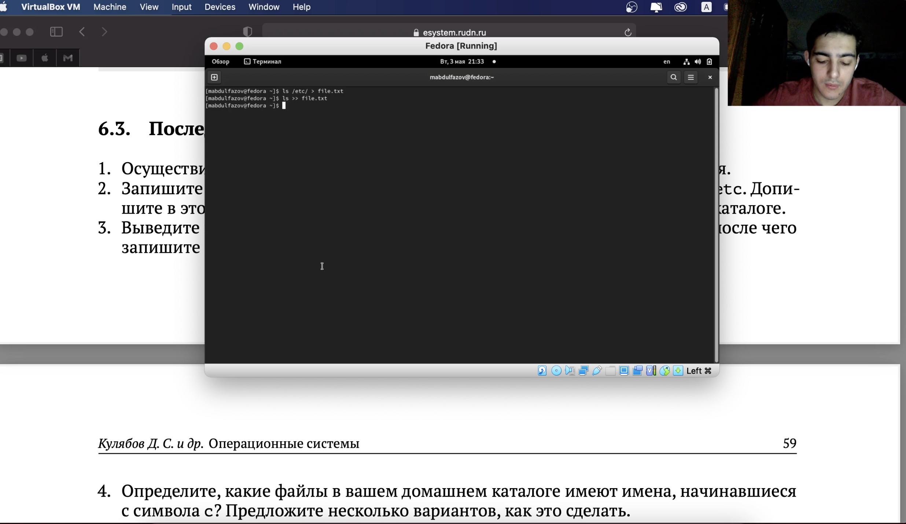{#fig:001 width=70%}

##

2. Вывел имена всех файлов из file.txt, имеющих расширение .conf, после чего записал их в новый текстовой файл conf.txt. (рис. 2)

{#fig:002 width=70%}

##

3. Определил, какие файлы в моём домашнем каталоге имеют имена, начинающиеся с символа c (рис. 3)

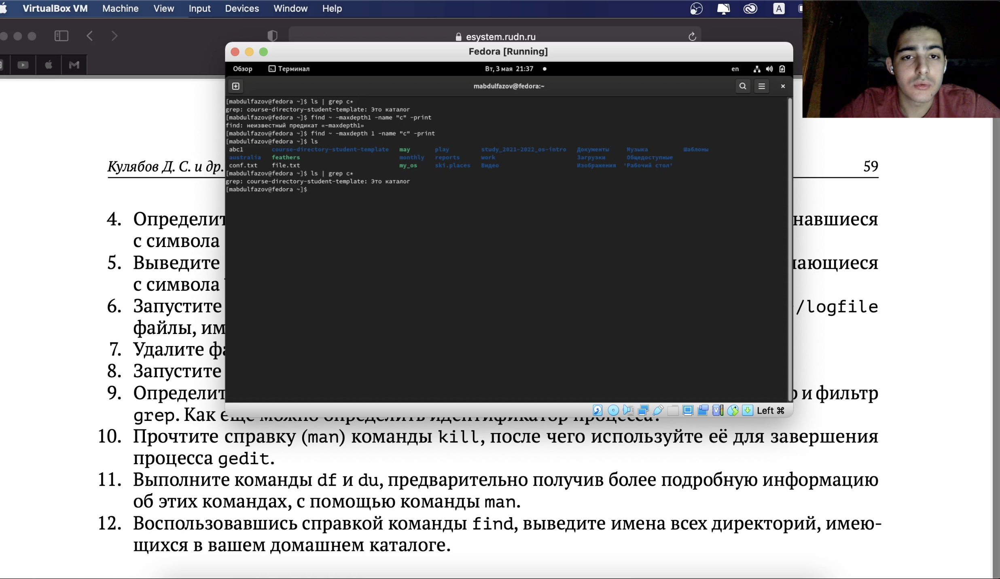{#fig:003 width=70%}

##

4.  Вывел на экран (постранично) имена файлов из каталога /etc, начинающиеся с символа h. (рис. 4)

{#fig:004 width=70%}

##

5. Запустил в фоновом режиме процесс, который записал в файл ~/logfile файлы, имена которых начинаются с log. (рис. 5)

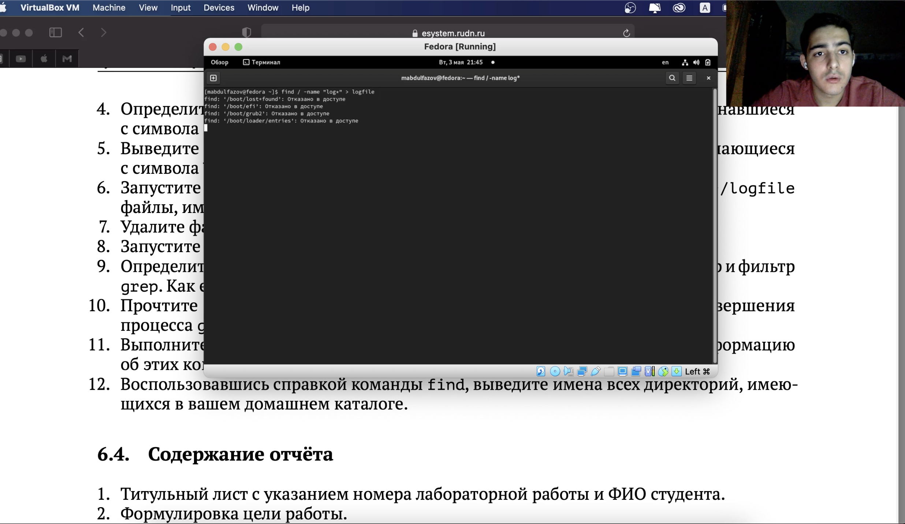{#fig:005 width=70%}

##

6.  Удалил файл ~/logfile. Запустил из консоли в фоновом режиме редактор gedit. (рис. 6)

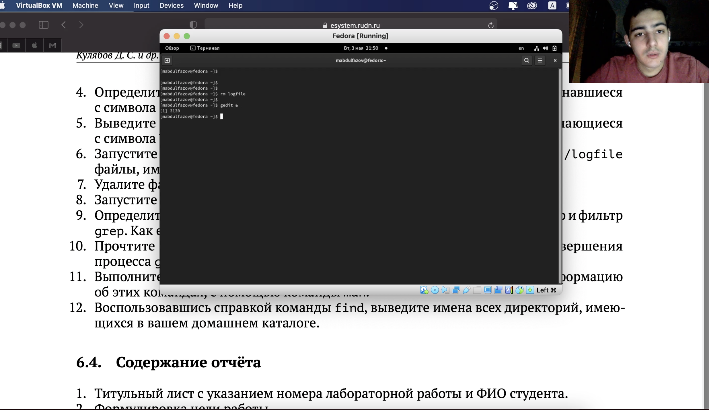{#fig:006 width=70%}

##

7. Определил идентификатор процесса gedit, используя команду ps, конвейер и фильтр grep.(рис. 7)

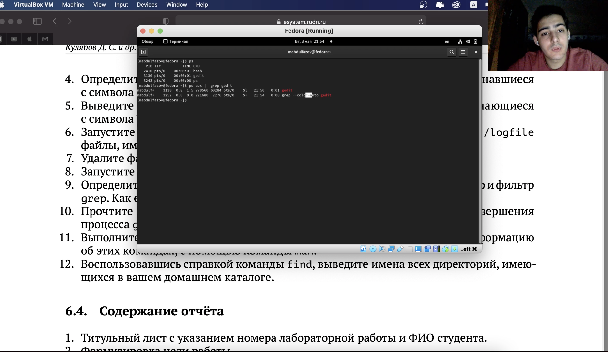{#fig:007 width=70%}

##

8.  Прочёл справку (man) команды kill, после чего использовал её для завершения процесса gedit. (рис. 8 и рис. 9)

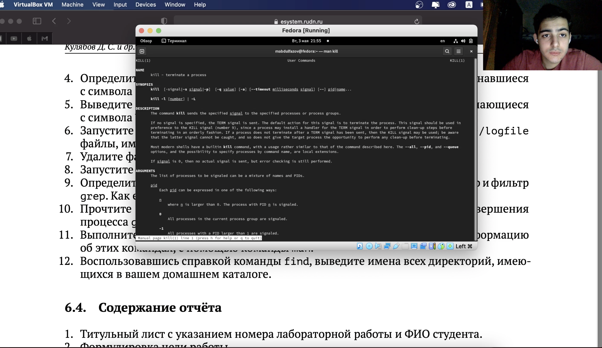{#fig:008 width=70%}

##

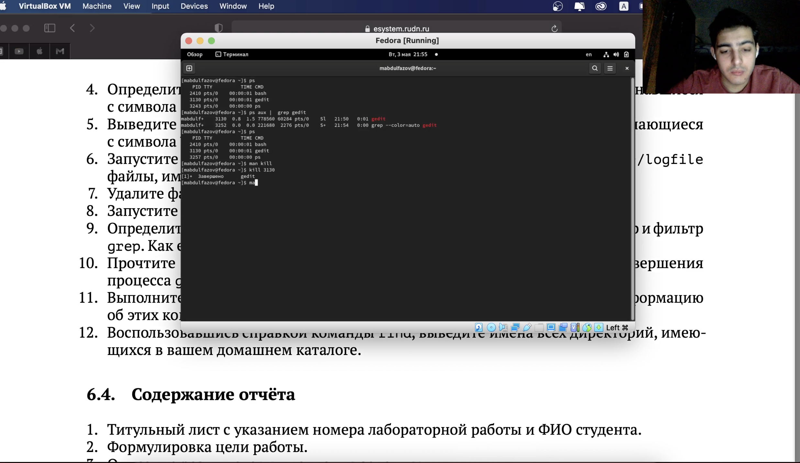{#fig:009 width=70%}

##

9.  Выполнил команды df и du, предварительно получив более подробную информацию
        об этих командах, с помощью команды man. (рис. 10, рис. 11, рис. 12, рис. 13)

{#fig:010 width=70%}

##

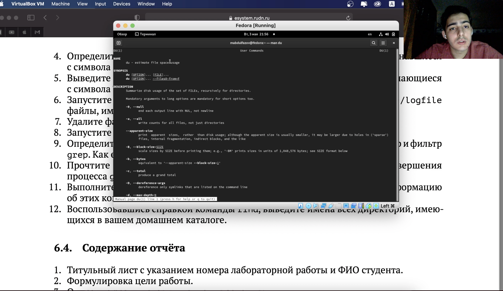{#fig:011 width=70%}

##

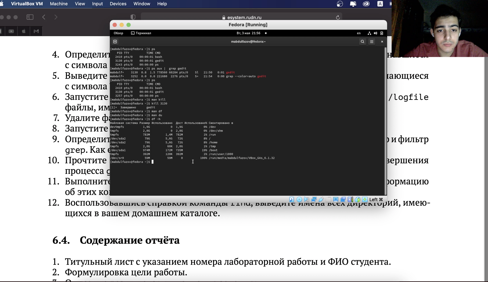{#fig:012 width=70%}

##

{#fig:013 width=70%}

##

10. Воспользовавшись справкой команды find, вывел имена всех директорий, имеющихся в вашем домашнем каталоге. (рис. 14 и рис. 15)

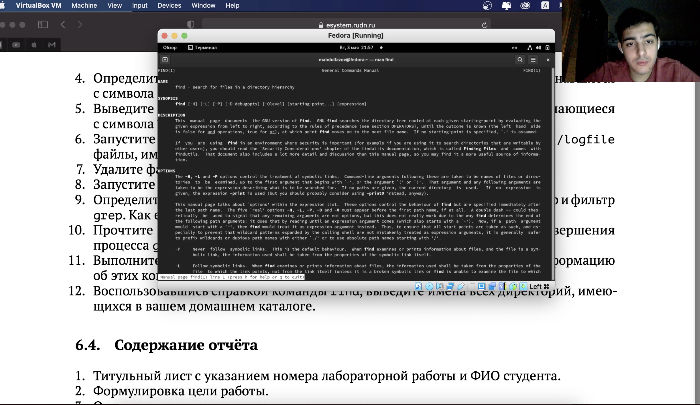{#fig:014 width=70%}

##

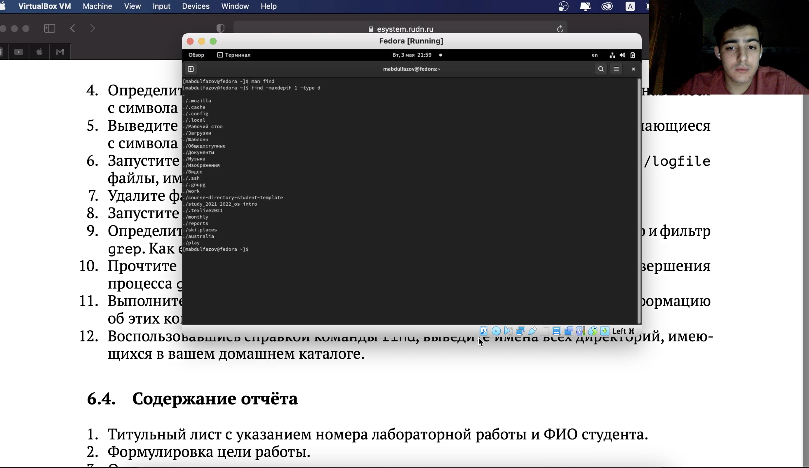{#fig:015 width=70%}

## Вывод

Ознакомился с инструментами поиска файлов и фильтрации текстовых данных. Приобрёл практические навыки: по управлению процессами (и заданиями), по проверке использования диска и обслуживанию файловых систем.
