---
# Front matter
lang: ru-RU
title: "Лабораторная работа 6"
subtitle: "Поиск файлов. Перенаправление ввода-вывода. Просмотр запущенных процессов"
author: "Абдулфазов Мансур Али оглы"

# Formatting
toc-title: "Содержание"
toc: true # Table of contents
toc_depth: 2
fontsize: 12pt
linestretch: 1.5
papersize: a4paper
documentclass: scrreprt
polyglossia-lang: russian
polyglossia-otherlangs: english
mainfont: PT Serif
romanfont: PT Serif
sansfont: PT Sans
monofont: PT Mono
mainfontoptions: Ligatures=TeX
romanfontoptions: Ligatures=TeX
sansfontoptions: Ligatures=TeX,Scale=MatchLowercase
monofontoptions: Scale=MatchLowercase
indent: true
pdf-engine: lualatex
header-includes:
  - \linepenalty=10 # the penalty added to the badness of each line within a paragraph (no associated penalty node) Increasing the value makes tex try to have fewer lines in the paragraph.
  - \interlinepenalty=0 # value of the penalty (node) added after each line of a paragraph.
  - \hyphenpenalty=50 # the penalty for line breaking at an automatically inserted hyphen
  - \exhyphenpenalty=50 # the penalty for line breaking at an explicit hyphen
  - \binoppenalty=700 # the penalty for breaking a line at a binary operator
  - \relpenalty=500 # the penalty for breaking a line at a relation
  - \clubpenalty=150 # extra penalty for breaking after first line of a paragraph
  - \widowpenalty=150 # extra penalty for breaking before last line of a paragraph
  - \displaywidowpenalty=50 # extra penalty for breaking before last line before a display math
  - \brokenpenalty=100 # extra penalty for page breaking after a hyphenated line
  - \predisplaypenalty=10000 # penalty for breaking before a display
  - \postdisplaypenalty=0 # penalty for breaking after a display
  - \floatingpenalty =20000 # penalty for splitting an insertion (can only be split footnote in standard LaTeX)
  - \raggedbottom # or \flushbottom
  - \usepackage{float} # keep figures where there are in the text
  - \floatplacement{figure}{H} # keep figures where there are in the text
---

# Цель работы

Ознакомление с инструментами поиска файлов и фильтрации текстовых данных. Приобретение практических навыков: по управлению процессами (и заданиями), по проверке использования диска и обслуживанию файловых систем.

# Задание 

1. Осуществите вход в систему, используя соответствующее имя пользователя.
2. Запишите в файл file.txt названия файлов, содержащихся в каталоге /etc. Допишите в этот же файл названия файлов, содержащихся в вашем домашнем каталоге.
3. Выведите имена всех файлов из file.txt, имеющих расширение .conf, после чего запишите их в новый текстовой файл conf.txt.
 4. Определите, какие файлы в вашем домашнем каталоге имеют имена, начинавшиеся с символа c? Предложите несколько вариантов, как это сделать.
5. Выведите на экран (постранично) имена файлов из каталога /etc, начинающиеся с символа h.
6. Запустите в фоновом режиме процесс, который будет записывать в файл ~/logfile файлы, имена которых начинаются с log.
7. Удалите файл ~/logfile.
8. Запустите из консоли в фоновом режиме редактор gedit.
9. Определите идентификатор процесса gedit, используя команду ps, конвейер и фильтр grep. Как ещё можно определить идентификатор процесса?
10. Прочтите справку (man) команды kill, после чего используйте её для завершения процесса gedit.
11. Выполните команды df и du, предварительно получив более подробную информацию
        об этих командах, с помощью команды man.
12. Воспользовавшись справкой команды find, выведите имена всех директорий, имеющихся в вашем домашнем каталоге.

# Выполнение лабораторной работы

1. Записал в файл file.txt названия файлов, содержащихся в каталоге /etc и дописал в этот же файл названия файлов, содержащихся в моём домашнем каталоге. (рис. 1)

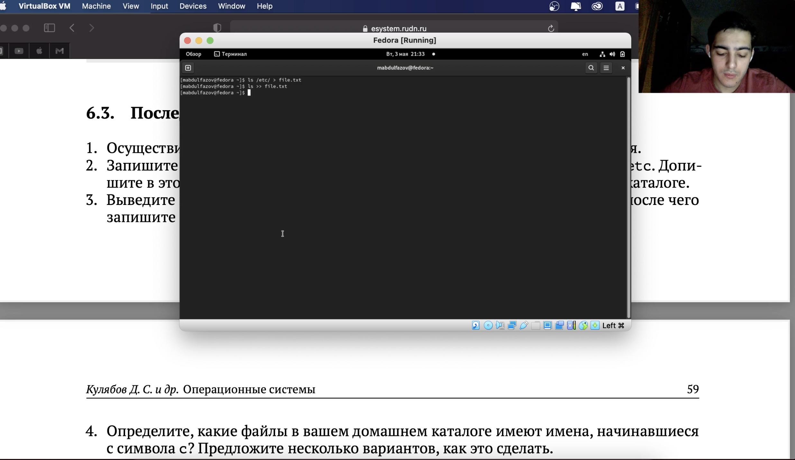{#fig:001 width=70%}

2. Вывел имена всех файлов из file.txt, имеющих расширение .conf, после чего записал их в новый текстовой файл conf.txt. (рис. 2)

{#fig:002 width=70%}

3. Определил, какие файлы в моём домашнем каталоге имеют имена, начинающиеся с символа c (рис. 3)

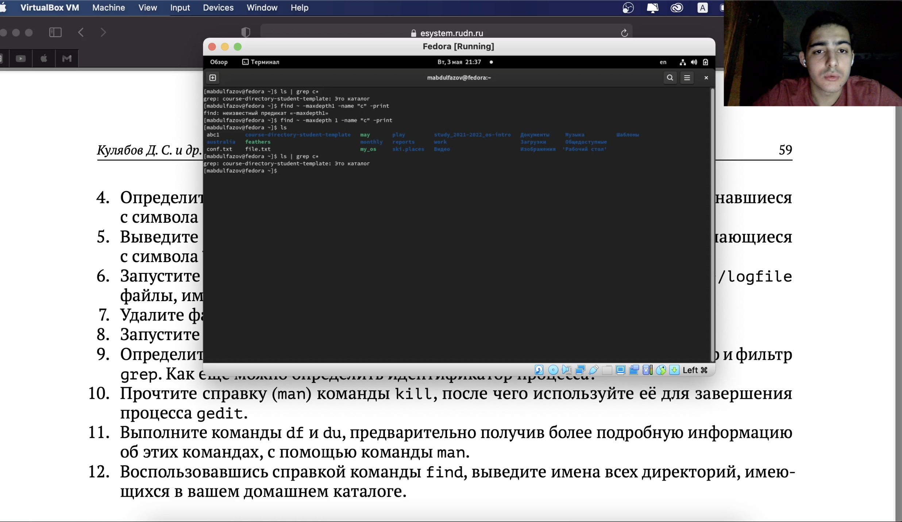{#fig:003 width=70%}

4.  Вывел на экран (постранично) имена файлов из каталога /etc, начинающиеся с символа h. (рис. 4)

{#fig:004 width=70%}

5. Запустил в фоновом режиме процесс, который записал в файл ~/logfile файлы, имена которых начинаются с log. (рис. 5)

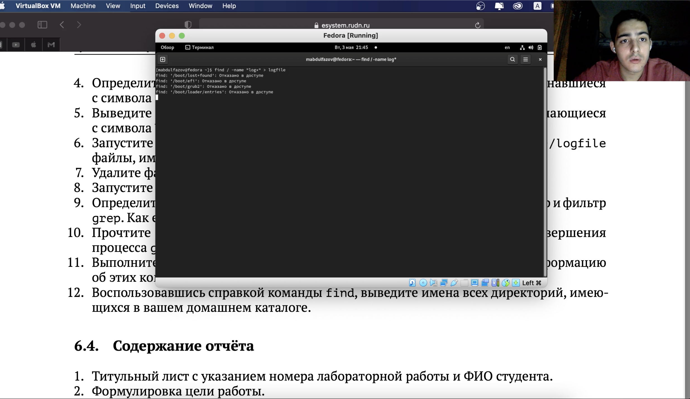{#fig:005 width=70%}

6.  Удалил файл ~/logfile. Запустил из консоли в фоновом режиме редактор gedit. (рис. 6)

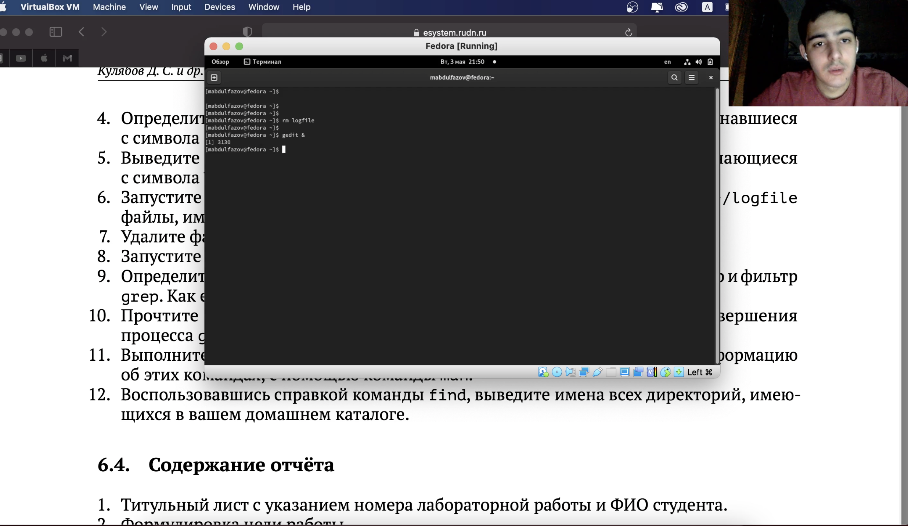{#fig:006 width=70%}

7. Определил идентификатор процесса gedit, используя команду ps, конвейер и фильтр grep.(рис. 7)

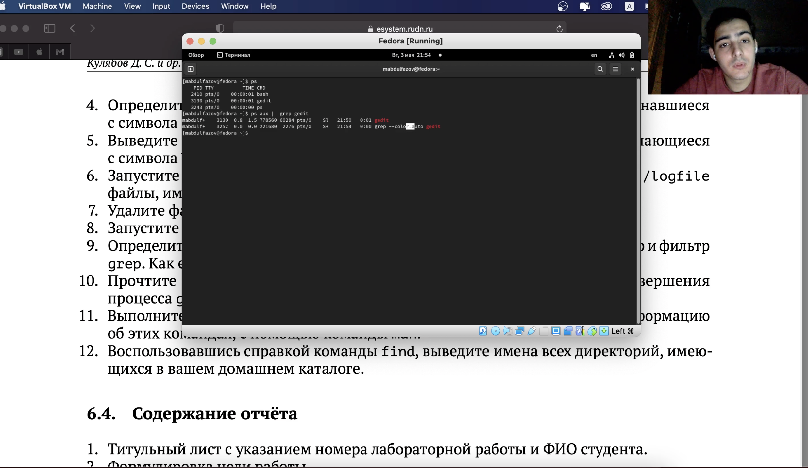{#fig:007 width=70%}

8.  Прочёл справку (man) команды kill, после чего использовал её для завершения процесса gedit. (рис. 8 и рис. 9)

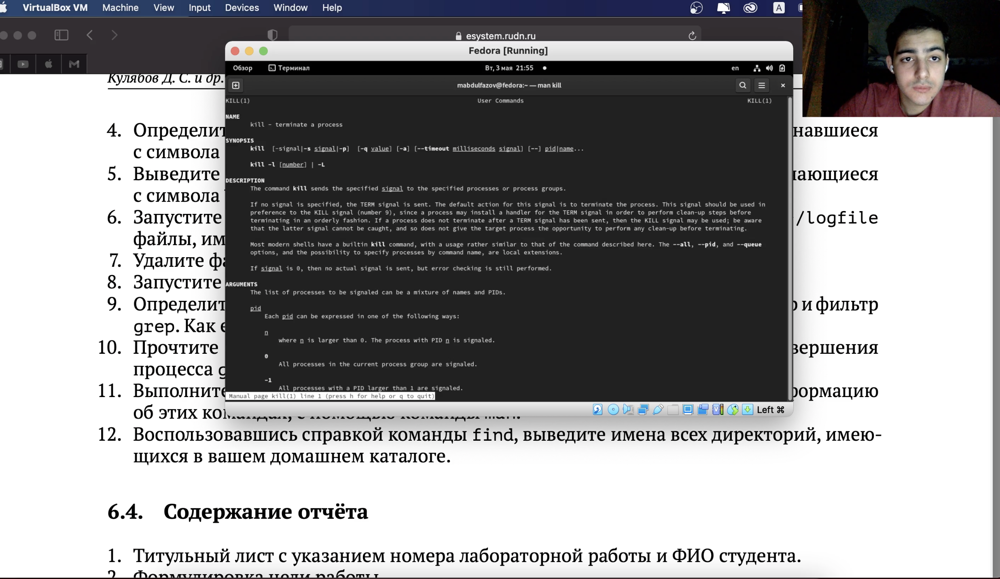{#fig:008 width=70%}

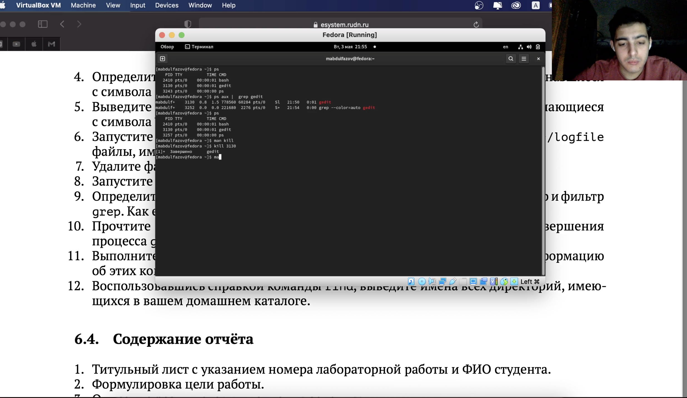{#fig:009 width=70%}

9.  Выполнил команды df и du, предварительно получив более подробную информацию
        об этих командах, с помощью команды man. (рис. 10, рис. 11, рис. 12, рис. 13)

{#fig:010 width=70%}

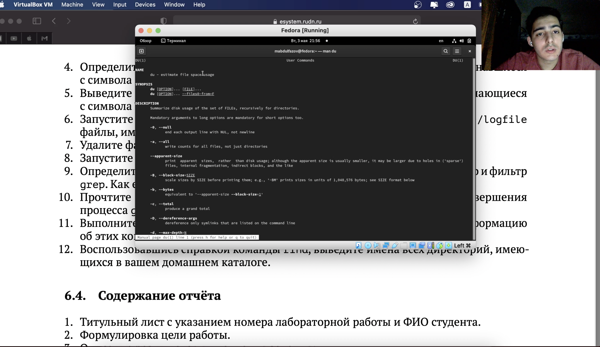{#fig:011 width=70%}

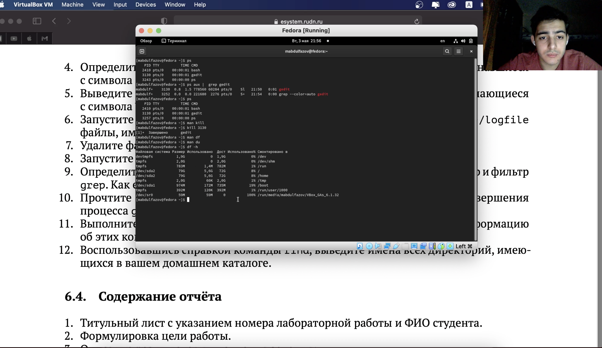{#fig:012 width=70%}

{#fig:013 width=70%}

10. Воспользовавшись справкой команды find, вывел имена всех директорий, имеющихся в вашем домашнем каталоге. (рис. 14 и рис. 15)

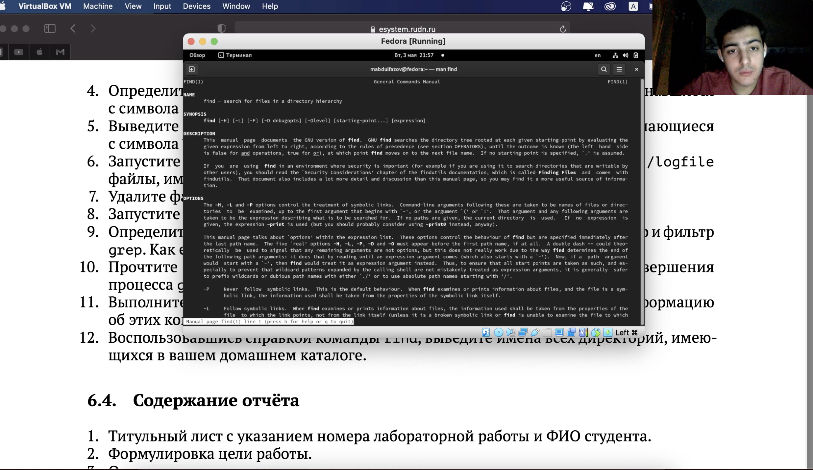{#fig:014 width=70%}

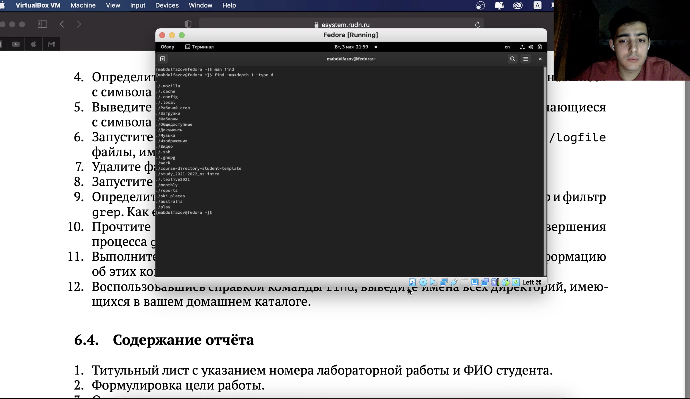{#fig:015 width=70%}

# Вывод

Ознакомился с инструментами поиска файлов и фильтрации текстовых данных. Приобрёл практические навыки: по управлению процессами (и заданиями), по проверке использования диска и обслуживанию файловых систем.

# Контрольные вопросы

1. Какие потоки ввода вывода вы знаете

– stdin — стандартный поток ввода (клавиатура),

– stdout — стандартный поток вывода (консоль),

– stderr — стандартный поток вывод сообщений об ошибках на экран

2. Объясните разницу между операцией > и >>.

Символ < используется для переназначения стандартного ввода команды. Символ >> используется для присоединения данных в конец файла стандартного вывода команды(файл открывается в режиме добавления)

3. Что такое конвейер?

Конвейер - способ связи между двумя программами.Конвейер (pipe) служит для объединения простых команд или утилит в цепочки, в которых результат работы предыдущей команды передается последующей. Синтаксис следующий: команда1 | команда 2

4. Что такое PID и GID?

Process ID(PID) - идентификатор порожденного процесса. Group ID (GID-идентификация группы пользователей.

5. Что такое процесс? Чем это понятие отличается от программы??

Процесс - это программа, которая выполняется в отдельном виртуальном адресном пространстве. Когда пользователь регистрируется в системе, автоматически создается процесс, в котором выполняется оболочка (shell), например, /bin/bash. Компьютерная программа сама по себе — это только пассивная совокупность инструкций, в то время как процесс — это непосредственное выполнение этих инструкций.

6. Что такое задачи и какая команда позволяет ими управлять?

Запущенные фоном программы называются задачами (jobs). Ими можно управлять с помощью команды jobs, которая выводит список запущенных в данный момент задач. Для завершения задачи необходимо выполнить команду : kill %номер задачи

7. Найдите информацию об утилитах top и htop. Каковы их функции? 
top показывает объем занятой памяти вместе с кэш. htop выдает объём реально занятой памяти без кэша.

10. Как определить объем свободной памяти на жёстком диске? 
Кодмандой df

11. Как определить объем вашего домашнего каталога? 
Кодмандой du

12. Как удалить зависший процесс? 
kill PID
