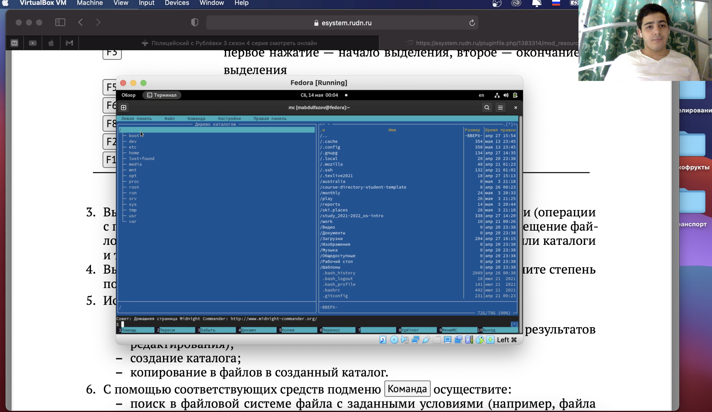
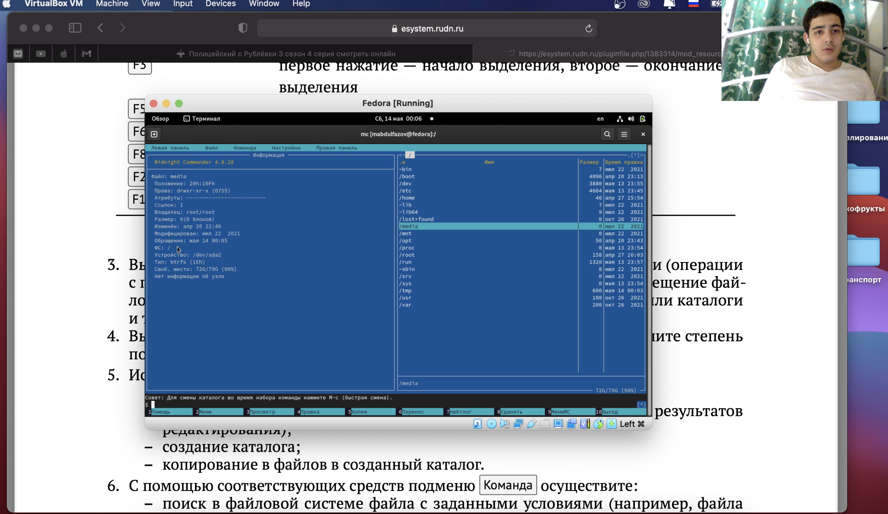
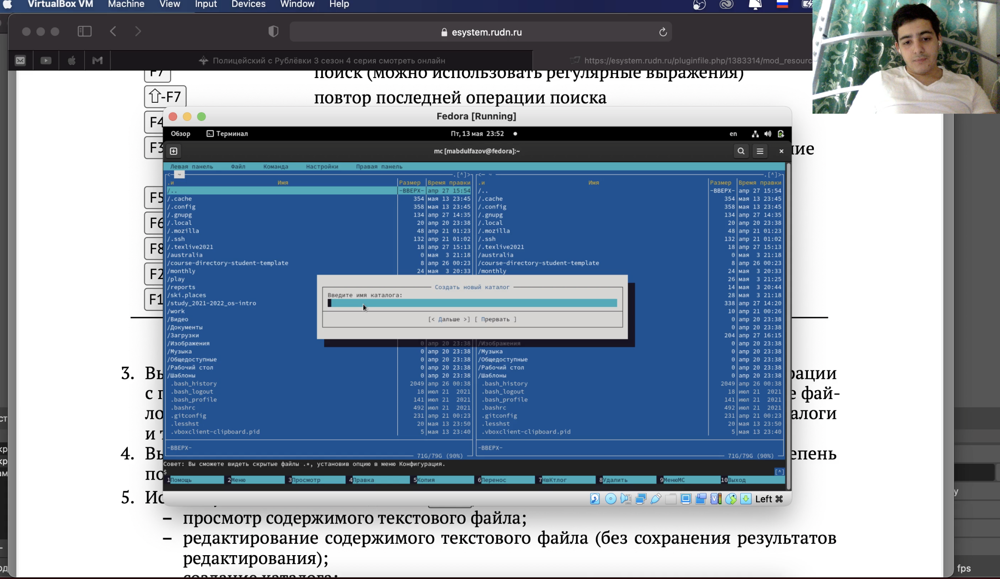
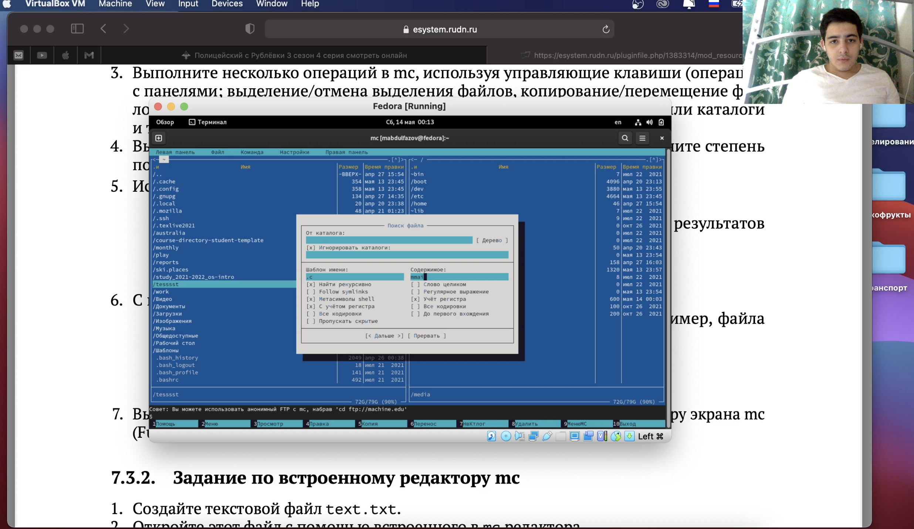
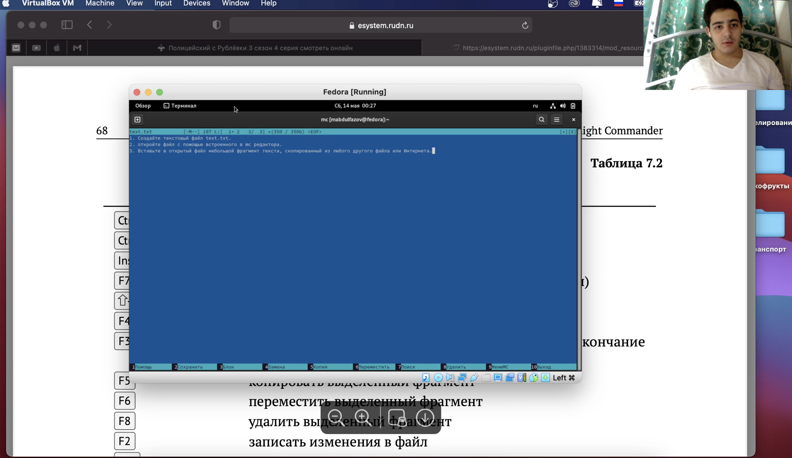

---
## Front matter
lang: ru-RU
title: Командная оболочка Midnight Commander
author: Мансур А. о. Абдулфазов\inst{1,3}
        Группа НФИбд-01-21
date: 14 Мая, 2021, Россия, Москва

## Formatting
toc: false
slide_level: 2
theme: metropolis
header-includes: 
 - \metroset{progressbar=frametitle,sectionpage=progressbar,numbering=fraction}
 - '\makeatletter'
 - '\beamer@ignorenonframefalse'
 - '\makeatother'
aspectratio: 43
section-titles: true
---

## Цель работы

Освоение основных возможностей командной оболочки Midnight Commander. Приобретение навыков практической работы по просмотру каталогов и файлов; манипуляций
с ними.

## Выполнение лабораторной работы

1. Изменение левой панели на дерево (рис.1)

{ #fig:001 width=90% }

##

2. Свойства файлов на левой панели (рис. 2)

{#fig:002 width=90% }

##

3. Создание нового каталога (рис. 3)

{ #fig:003 width=90% }

##

4. Поиск файла .с со строкой внутри main (рис. 4) 

{#fig:004 width=90% }

##

5. Работа с файлом (рис. 7)

{ #fig:007 width=70% }

## Вывод

Освоил основные возможности командной оболочки Midnight Commander. Приобрёл навыки практической работы по просмотру каталогов и файлов; манипуляций с ними.

