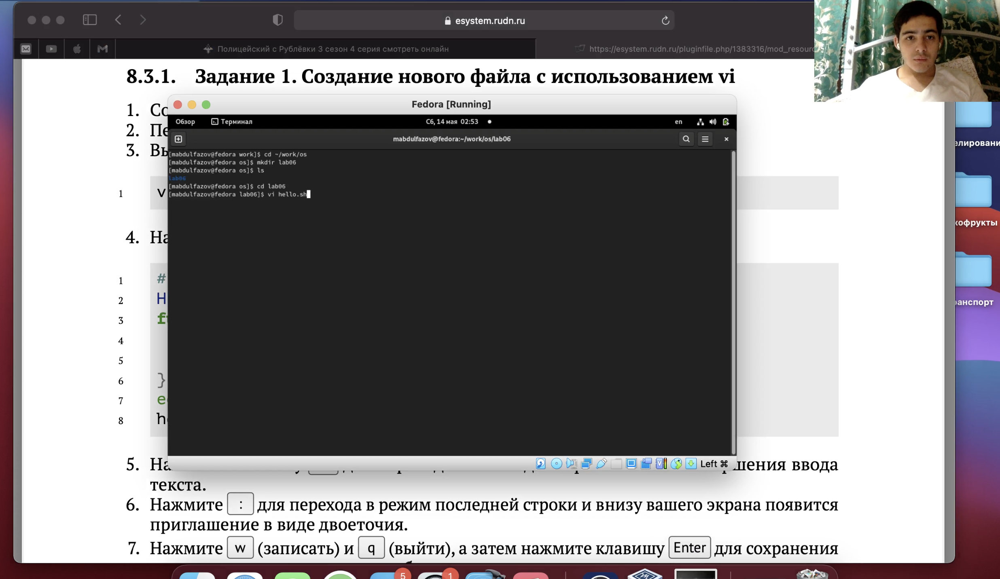
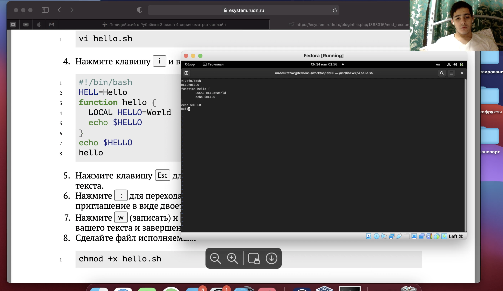
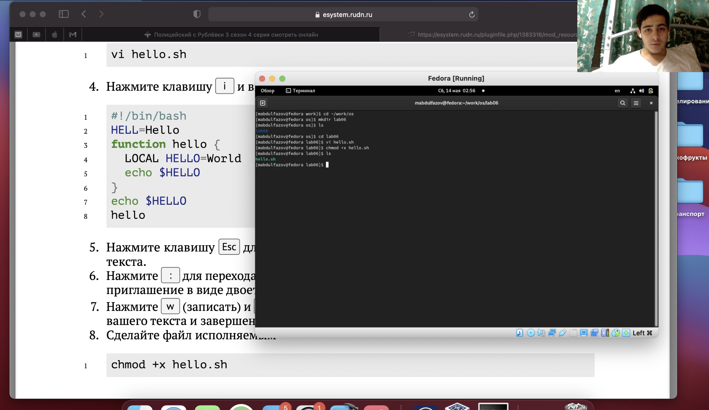

---
# Front matter
lang: ru-RU
title: "Лабораторная работа 8"
subtitle: "Текстовой редактор vi"
author: "Абдулфазов Мансур Али оглы"

# Formatting
toc-title: "Содержание"
toc: true # Table of contents
toc_depth: 2
fontsize: 12pt
linestretch: 1.5
papersize: a4paper
documentclass: scrreprt
polyglossia-lang: russian
polyglossia-otherlangs: english
mainfont: PT Serif
romanfont: PT Serif
sansfont: PT Sans
monofont: PT Mono
mainfontoptions: Ligatures=TeX
romanfontoptions: Ligatures=TeX
sansfontoptions: Ligatures=TeX,Scale=MatchLowercase
monofontoptions: Scale=MatchLowercase
indent: true
pdf-engine: lualatex
header-includes:
  - \linepenalty=10 # the penalty added to the badness of each line within a paragraph (no associated penalty node) Increasing the value makes tex try to have fewer lines in the paragraph.
  - \interlinepenalty=0 # value of the penalty (node) added after each line of a paragraph.
  - \hyphenpenalty=50 # the penalty for line breaking at an automatically inserted hyphen
  - \exhyphenpenalty=50 # the penalty for line breaking at an explicit hyphen
  - \binoppenalty=700 # the penalty for breaking a line at a binary operator
  - \relpenalty=500 # the penalty for breaking a line at a relation
  - \clubpenalty=150 # extra penalty for breaking after first line of a paragraph
  - \widowpenalty=150 # extra penalty for breaking before last line of a paragraph
  - \displaywidowpenalty=50 # extra penalty for breaking before last line before a display math
  - \brokenpenalty=100 # extra penalty for page breaking after a hyphenated line
  - \predisplaypenalty=10000 # penalty for breaking before a display
  - \postdisplaypenalty=0 # penalty for breaking after a display
  - \floatingpenalty = 20000 # penalty for splitting an insertion (can only be split footnote in standard LaTeX)
  - \raggedbottom # or \flushbottom
  - \usepackage{float} # keep figures where there are in the text
  - \floatplacement{figure}{H} # keep figures where there are in the text
---

# Цель работы

Познакомиться с операционной системой Linux. Получить практические навыки работы с редактором vi, установленным по умолчанию практически во всех дистрибутивах.

# Выполнение лабораторной работы

1. Создадим файл hello.sh (рис. 1)

{ #fig:001 width=90% }

2. Запишем в него то что требуется в лабораторной работе (рис. 2)

{#fig:002 width=90% }

3. Сделаем файл исполняемым(рис. 3)

{ #fig:003 width=90% }

4. Далее необходимо было проделать работу по изменению файла с помощью горячих клавиш. С результатами можно ознакомиться в видеоотчете (Выполнение)

# Вывод

Познакомился с операционной системой Linux. Получил практические навыки работы с редактором vi, установленным по умолчанию практически во всех дистрибутивах.

# Контрольные вопросы
1.	Командный режим позволяет управлять курсором и вводить команды редактирования. 
Режим вставки допускает производить ввод текста. При этом текст не будет восприниматься, как команды редактирования. 
Режим последней строки позволяет производить запись файла на диск и выходить из редактора Vi. Кроме того, используя этот режим, можно вводить дополнительные команды редактирования. 
2.	Если необходимо просто выйти Vi (без сохранения выполненных изменений), то необходимо в последней строке набрать символ q (или q!). 
3.	0 (ноль) - перейти в начало строки; 
$ - перейти в конец строки; G - перейти в конец файла; nG - перейти на строку номер n. 
4.	Редактор vi предполагает, что слово - это строка символов, которая может включать в себя буквы, цифры и символы подчеркивания. 
5.	0 (ноль) - перейти в начало строки; 
$ - перейти в конец строки; 6. Добавление / вставка текста а- добавить текст после курсора; А- добавить текст в конец строки; i- вставить текст перед курсором; 
ni- вставить текст n раз; 
I- вставить текст в началостроки. Вставка строки o-вставить строку под курсором; О- вставить строку над курсором. Удаление текста x- удалить один символ в буфер; dw- удалить одно слово в буфер; 
d$- удалить в буфер текст от курсора до конца строки; 
d0-(ноль) - удалить в буфер текст от начала строки до позиции курсора; dd- удалить в буфер одну строку; 10dd- удалить в буфер 10 строк. 
Отмена и повтор произведенных изменений u- отменить последнее изменение; - повторить последнее изменение. 
Копирование текста в буфер Y- скопировать строку в буфер; nY- скопировать n строк в буфер; yw- скопировать слово в буфер; Вставка текста из буфера p- вставить текст из буфера после курсора; P- вставить текст из буфера перед курсором. 
Замена текста cw - заменить слово; n cw - заменить n слов; 
c$- заменить текст от курсора до конца строки; 
r- заменить слово; R- заменить текст. 
Поиск текста 
/ <текст> - произвести поиск вперед по тексту указанной строки символов <текст>; 
? <текст> - произвести поиск назад по тексту указанной строки символов <текст>. 
7.	c$ - заменить текст от курсора до конца строки. 
8.	u- отменить последнее изменение 
9.	Kопирование и перемещение текста :n,m d-уничтожить строки с n по m 
пример: : 3,8d 
: i,j m k- переместить строки с i по j , начиная со строки k пример : : 4,9m12 
: i,j t k- копировать строки с i по j на строку k пример: : 2,5 t 13 
: i,j w <имя_файла>- записать строки с i по j в файл с именем <имя_файла> пример: : 5,9 <имя _файла>. Запись в файл и выход из редактора 
:w- записать измененныйтекст в файл на диске, не выходя из Vi; 
:w <newfile>- записать измененный текст в новый файл с именем <newfile>; 
:w! <имя_файла>- записать измененный текст в файл с именем<имя_файла> ; - :wq- записать изменения в файл и выйти из Vi; 
:q- выйти из редактора Vi; 
:q!- выйти из редактора без записи; 
:e!- вернуться в командный режим, отменив все изменения,произведенные со времени последней записи 
10.	$ - перемещает курсор в конец строки. 
11.	Опции редактора Vi позволяют настроить рабочую среду. Для задания опций используется команда set (в режиме последней строки): 
: set all - вывести полный список опций; 
: set nu - вывести номера строк; 
: set list - вывести невидимые символы; 
: set ic - не учитывать при поиске, является ли символ прописным или строчным. 
12.	Нажатие клавиши ESC всегда переводит Vi в командный режим (это удобно, когда вы точно не помните в каком режиме находитесь). Если вы нажмете клавишу ESC, находясь в командном режиме, машина напомнит вам об этом, подав звуковой сигнал. 
13.	Командный –>вставки– >последняя строка (командная строка). 