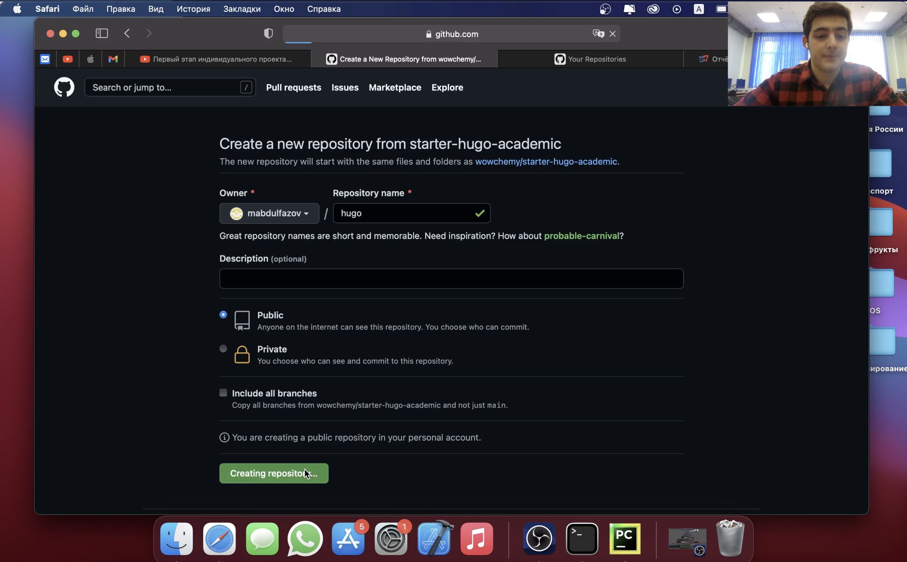
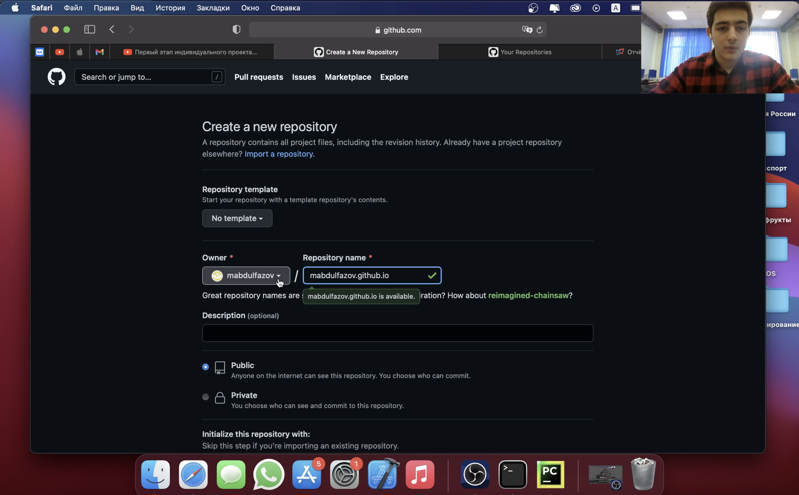
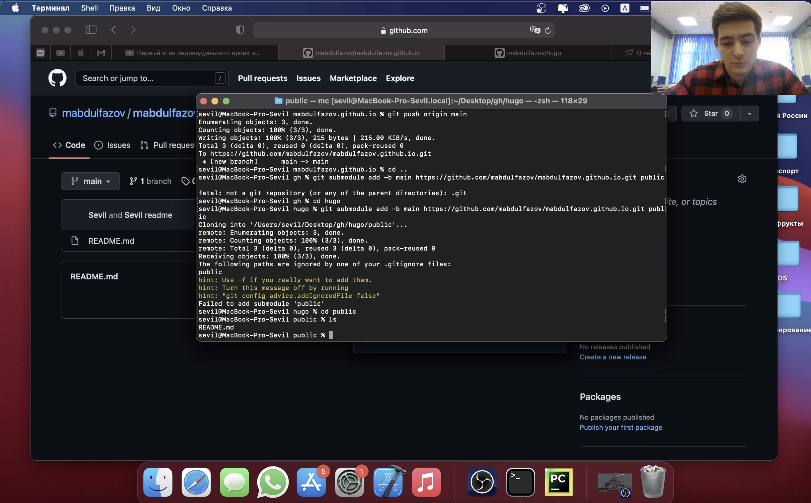
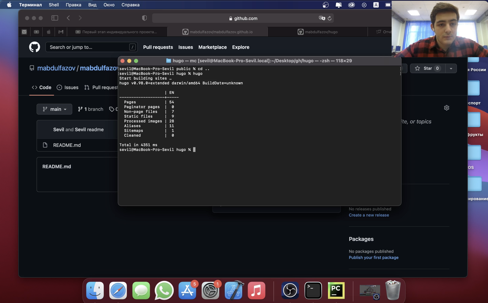
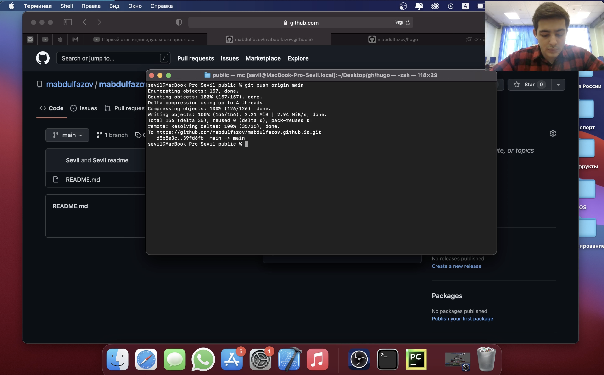
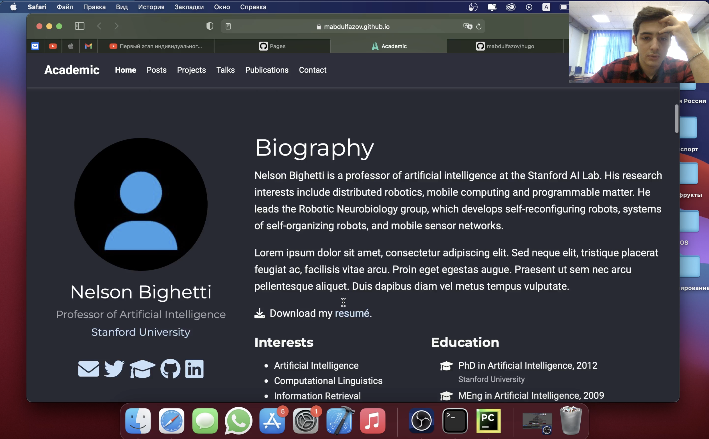

---
## Front matter
lang: ru-RU
title: Индивидуальный проект. Этап 1
author: Мансур А. о. Абдулфазов\inst{1,3}
	
date: 30 Апреля, 2021, Россия, Москва

## Formatting
toc: false
slide_level: 2
theme: metropolis
header-includes: 
 - \metroset{progressbar=frametitle,sectionpage=progressbar,numbering=fraction}
 - '\makeatletter'
 - '\beamer@ignorenonframefalse'
 - '\makeatother'
aspectratio: 43
section-titles: true
---

## Задание 

Размещение на _Github pages_ заготовки для персонального сайта.
    
  * Установить необходимое программное обеспечение.
  * Скачать шаблон темы сайта
  * Разместить его на хостинге git.
  * Установить параметр для _URLs_ сайта.
  * Разместить заготовку сайта на _Github pages_.

## Выполнение лабораторной работы

Скачал шаблон темы сайта в свой репозиторий. (рис.1)

{ #fig:001 width=70% }

##

Создал дополнительный репозиторий для статик файлов. (рис.2)

{ #fig:002 width=70% }

##

Скачал оба репозитория на своё устройство. (рис.3)

{ #fig:003 width=70% }

##

Добавил сабмодуль для своего сайта. (рис.4)

{ #fig:004 width=70% }

##

Создал сайт с помощью команды hugo. (рис.5)

{ #fig:005 width=70% }

##

Сохранил все изменения в локальном репозитории и отправил их в центральный репозиторий. (рис.6)

{ #fig:006 width=70% }

##

Продемонстрировал результат работы. (рис.7)

{ #fig:007 width=70% }

## Вывод
Получил первоначальные знания по использованию генератора статических сайтов  Hugo. Обрёл базовые навыки для созданияя собственного сайта.
