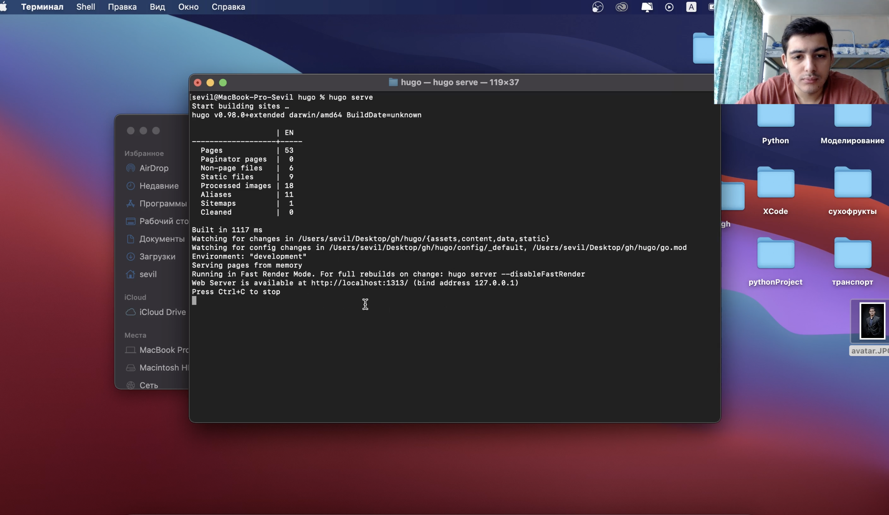
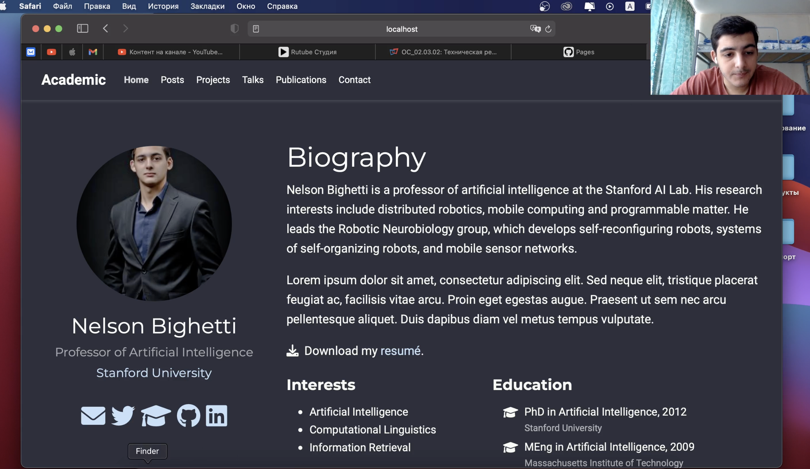
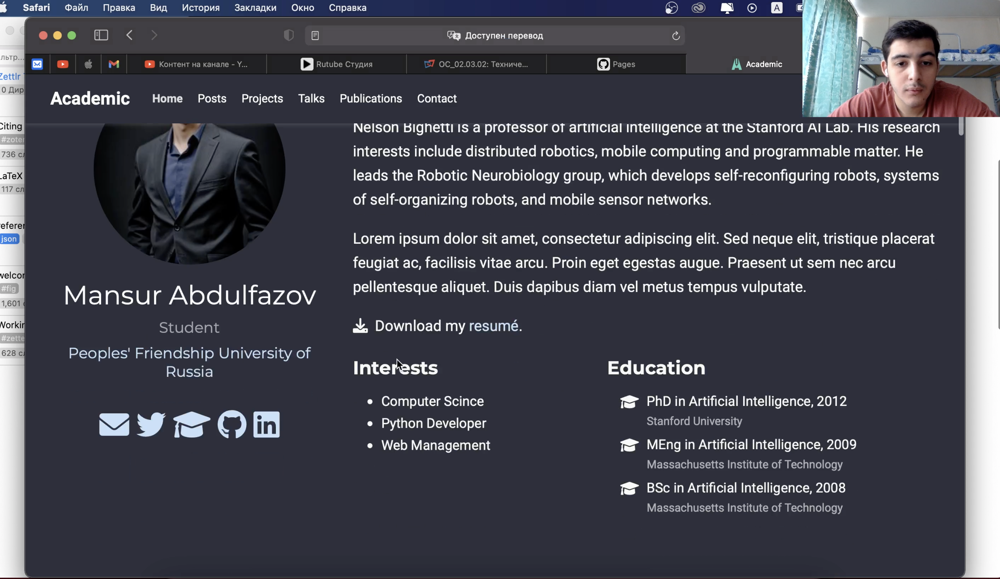
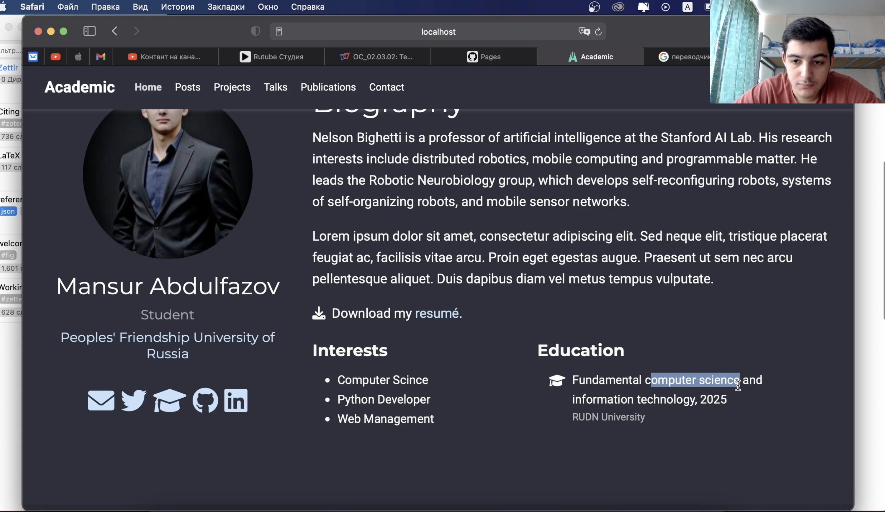
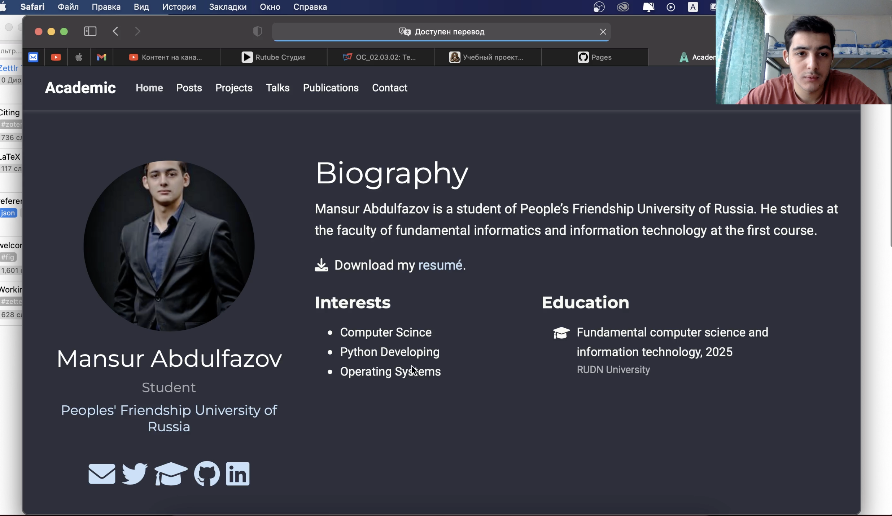
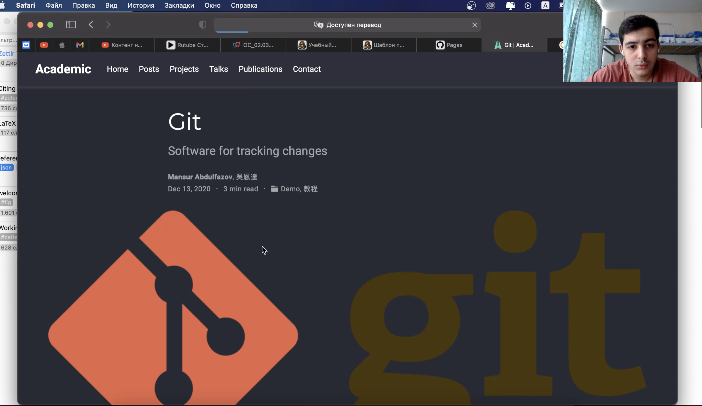
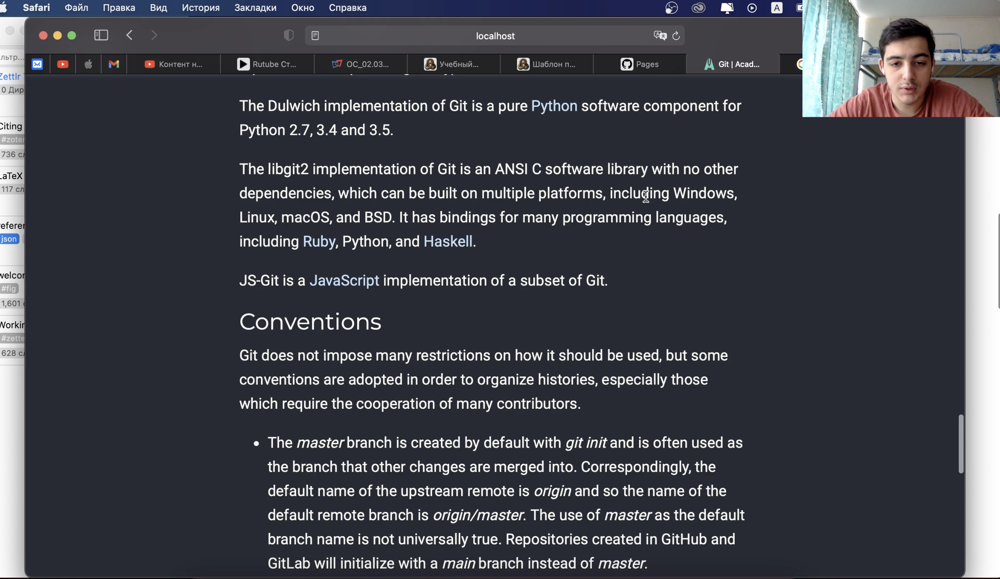

---
## Front matter
lang: ru-RU
title: Индивидуальный проект. Этап 2.
author: Мансур А. о. Абдулфазов\inst{1,3}
        Группа НФИбд-01-21
date: 7 Мая, 2021, Россия, Москва

## Formatting
toc: false
slide_level: 2
theme: metropolis
header-includes: 
 - \metroset{progressbar=frametitle,sectionpage=progressbar,numbering=fraction}
 - '\makeatletter'
 - '\beamer@ignorenonframefalse'
 - '\makeatother'
aspectratio: 43
section-titles: true
---

## Задание 

1.  Добавить к сайту данные о себе.
    
    * Список добавляемых данных.
        * Разместить фотографию владельца сайта.
        * Разместить краткое описание владельца сайта (Biography).
        * Добавить информацию об интересах (Interests).
        * Добавить информацию от образовании (Education).
    * Сделать пост по прошедшей неделе.
    * Добавить пост на тему по выбору:
        * Управление версиями. Git.
        * Непрерывная интеграция и непрерывное развертывание (CI/CD).

## Выполнение работы

1.  Запустил веб-сервер для его обслуживания и автоматической перезагрузки при редактировании страниц. (рис. 1)

{#fig:001 width=70%}

##

2. Изменил аватар профиля (рис. 2)

{#fig:002 width=70%}

##

 
3. Добавил информацию об интересах. (рис. 3)

{#fig:003 width=70%}

##

4.  Добавил информацию об образовании. (рис. 4)

{#fig:004 width=70%}

##

5. Добавил информацию о своей биографии. (рис. 5)

{#fig:005 width=70%}

##

6.  Добавил пост на тему "Git" (рис. 6)

{#fig:006 width=70%}

##

7. Посмотрел результат работы с постом.(рис. 7)

{#fig:007 width=70%}

## Вывод

Приобрёл навыки минимального редактирования сайта. Научился добавлять посты.
