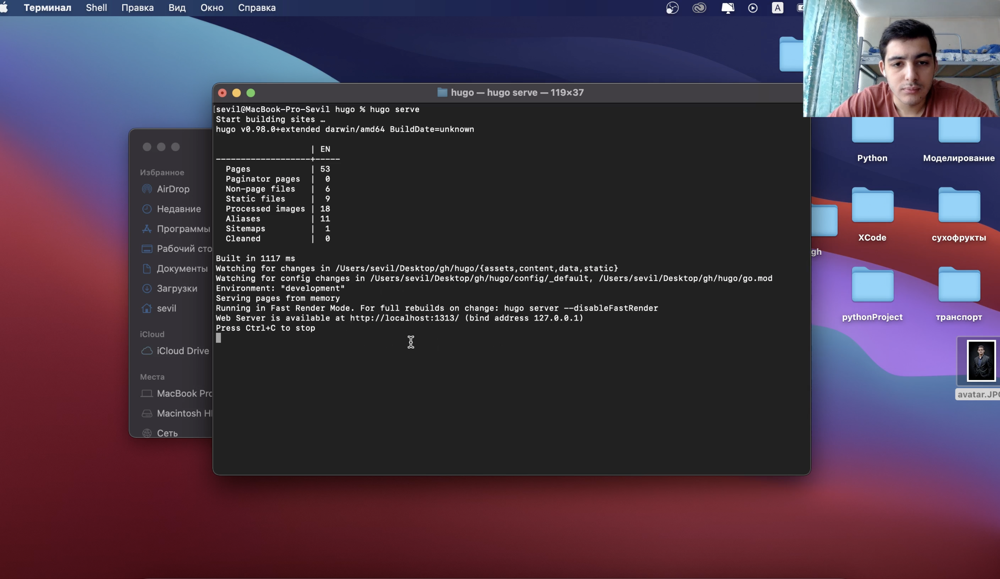
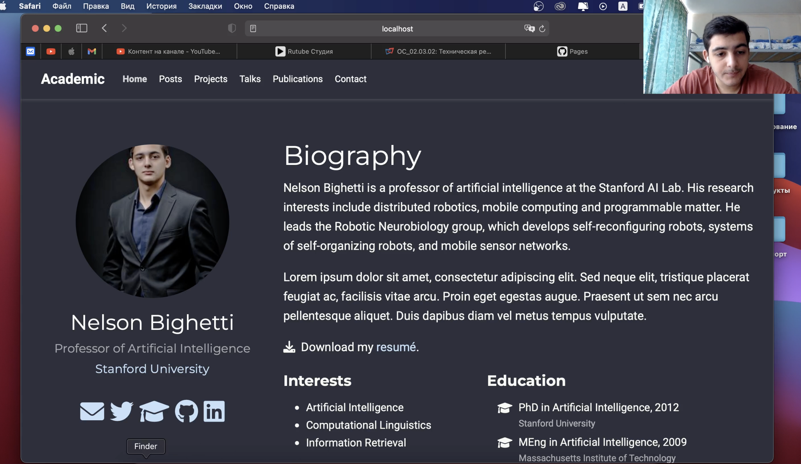
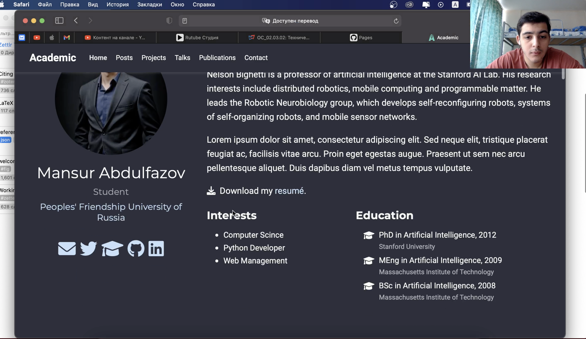
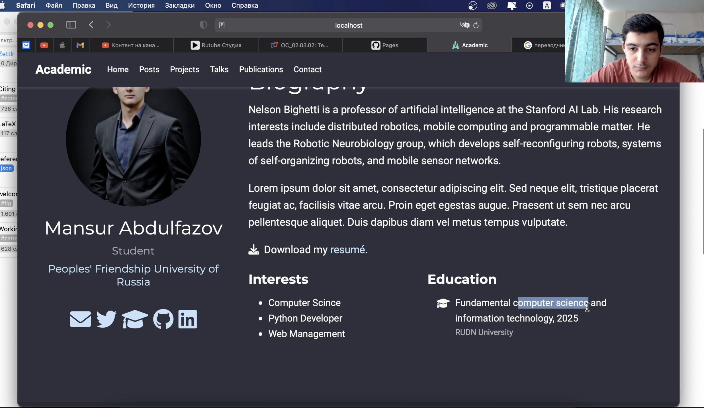
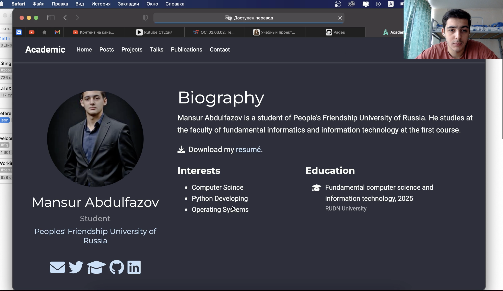
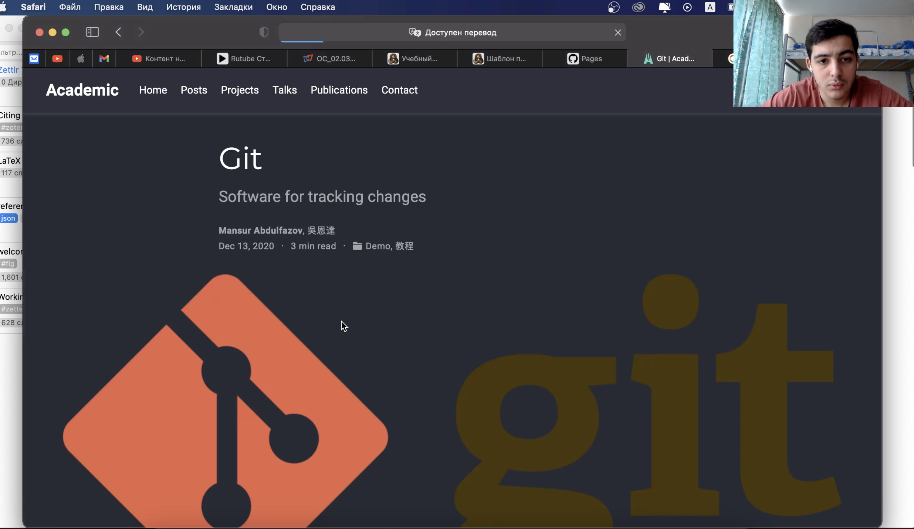
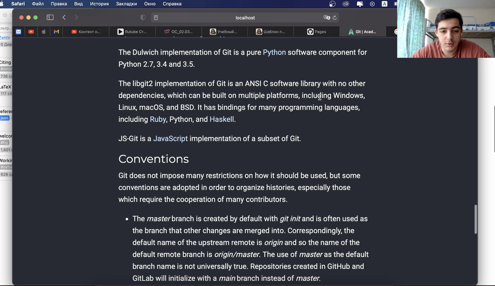

---
# Front matter
lang: ru-RU
title: "Индивидуальный проект"
subtitle: "Этап 2"
author: "Абдулфазов Мансур Али оглы"

# Formatting
toc-title: "Содержание"
toc: true # Table of contents
toc_depth: 2
fontsize: 12pt
linestretch: 1.5
papersize: a4paper
documentclass: scrreprt
polyglossia-lang: russian
polyglossia-otherlangs: english
mainfont: PT Serif
romanfont: PT Serif
sansfont: PT Sans
monofont: PT Mono
mainfontoptions: Ligatures=TeX
romanfontoptions: Ligatures=TeX
sansfontoptions: Ligatures=TeX,Scale=MatchLowercase
monofontoptions: Scale=MatchLowercase
indent: true
pdf-engine: lualatex
header-includes:
  - \linepenalty=10 # the penalty added to the badness of each line within a paragraph (no associated penalty node) Increasing the value makes tex try to have fewer lines in the paragraph.
  - \interlinepenalty=0 # value of the penalty (node) added after each line of a paragraph.
  - \hyphenpenalty=50 # the penalty for line breaking at an automatically inserted hyphen
  - \exhyphenpenalty=50 # the penalty for line breaking at an explicit hyphen
  - \binoppenalty=700 # the penalty for breaking a line at a binary operator
  - \relpenalty=500 # the penalty for breaking a line at a relation
  - \clubpenalty=150 # extra penalty for breaking after first line of a paragraph
  - \widowpenalty=150 # extra penalty for breaking before last line of a paragraph
  - \displaywidowpenalty=50 # extra penalty for breaking before last line before a display math
  - \brokenpenalty=100 # extra penalty for page breaking after a hyphenated line
  - \predisplaypenalty=10000 # penalty for breaking before a display
  - \postdisplaypenalty=0 # penalty for breaking after a display
  - \floatingpenalty =20000 # penalty for splitting an insertion (can only be split footnote in standard LaTeX)
  - \raggedbottom # or \flushbottom
  - \usepackage{float} # keep figures where there are in the text
  - \floatplacement{figure}{H} # keep figures where there are in the text
---

# Задание 

1.  Добавить к сайту данные о себе.
    
    * Список добавляемых данных.
        * Разместить фотографию владельца сайта.
        * Разместить краткое описание владельца сайта (Biography).
        * Добавить информацию об интересах (Interests).
        * Добавить информацию от образовании (Education).
    * Сделать пост по прошедшей неделе.
    * Добавить пост на тему по выбору:
        * Управление версиями. Git.
        * Непрерывная интеграция и непрерывное развертывание (CI/CD).

# Выполнение работы

1.  Запустил веб-сервер для его обслуживания и автоматической перезагрузки при редактировании страниц. (рис. 1)

{#fig:001 width=70%}

2. Изменил аватар профиля (рис. 2)

{#fig:002 width=70%}

3. Добавил информацию об интересах. (рис. 3)

{#fig:003 width=70%}

4.  Добавил информацию об образовании. (рис. 4)

{#fig:004 width=70%}

5. Добавил информацию о своей биографии. (рис. 5)

{#fig:005 width=70%}

6.  Добавил пост на тему "Git" (рис. 6)

{#fig:006 width=70%}

7. Посмотрел результат работы с постом.(рис. 7)

{#fig:007 width=70%}

# Вывод

Приобрёл навыки минимального редактирования сайта. Научился добавлять посты.

