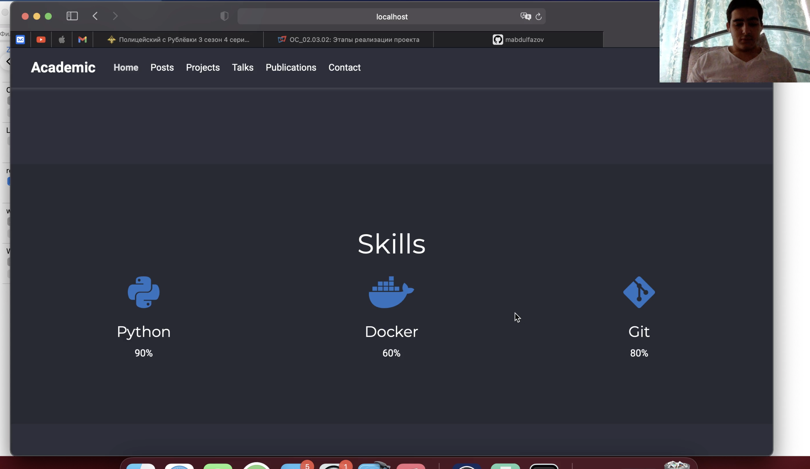
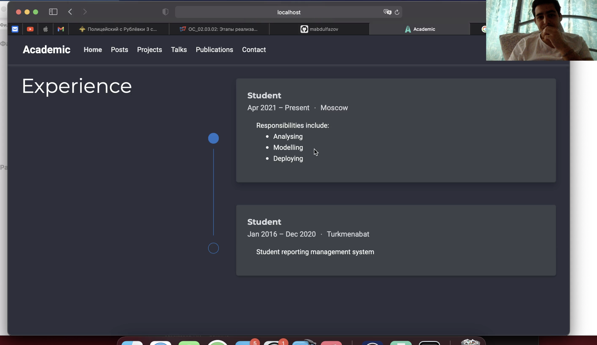
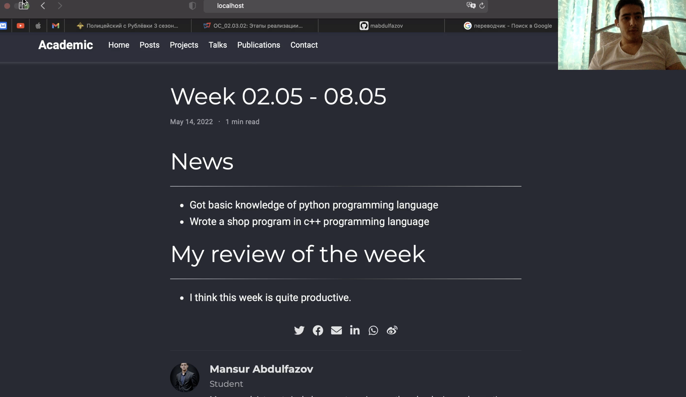
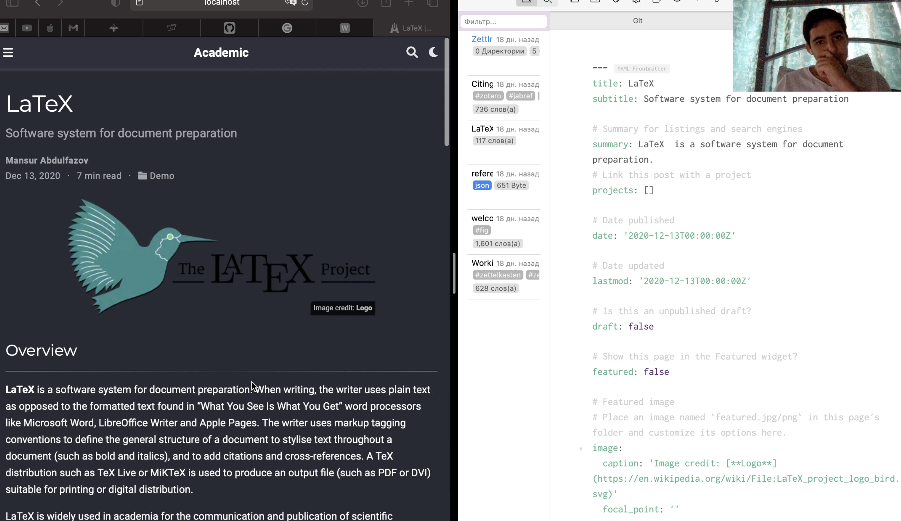

---
## Front matter
lang: ru-RU
title: Индивидуальный проект. Этап 3
author: Мансур А. о. Абдулфазов\inst{1,3}
        Группа НФИбд-01-21
date: 14 Мая, 2021, Россия, Москва

## Formatting
toc: false
slide_level: 2
theme: metropolis
header-includes: 
 - \metroset{progressbar=frametitle,sectionpage=progressbar,numbering=fraction}
 - '\makeatletter'
 - '\beamer@ignorenonframefalse'
 - '\makeatother'
aspectratio: 43
section-titles: true
---

## Цель работы

Добавить к сайту еще больше данные о себе. Добавить пост на тему: "LaTeX."

# Выполнение лабораторной работы

1. Добавить информацию о навыках (Skills).

Необходимо зайти в файл `content/home/skills.md` и изменить там данные (рис. 1).

{ #fig:001 width=90% }

##

2. Добавить информацию об опыте (Experience).

Необходимо зайти в файл `content/home/experience.md` и изменить там данные (рис. 2).

{ #fig:002 width=90% }

##

3. Сделать пост по прошедшей неделе. (рис. 4)

{ #fig:004 width=90% }

##

4. Добавить пост на тему: LaTeX (рис. 5)

{ #fig:005 width=90% }

## Вывод

Добавил данные об опыте, достижениях и навыках. Сделал пост по прошедшей неделе. Сделал пост на тему LaTeX.

